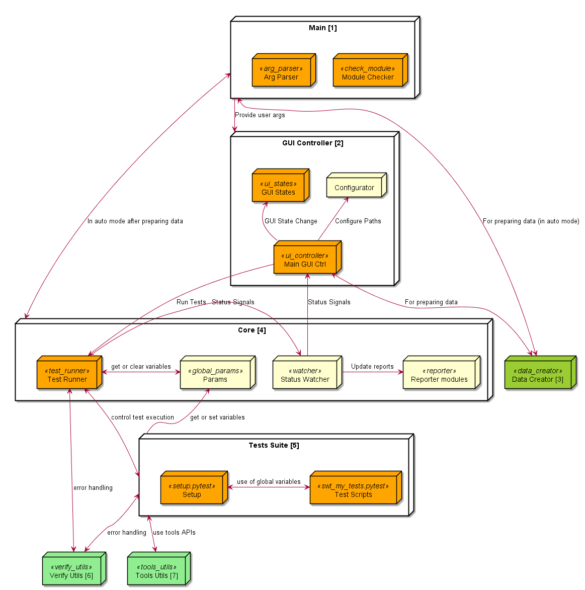
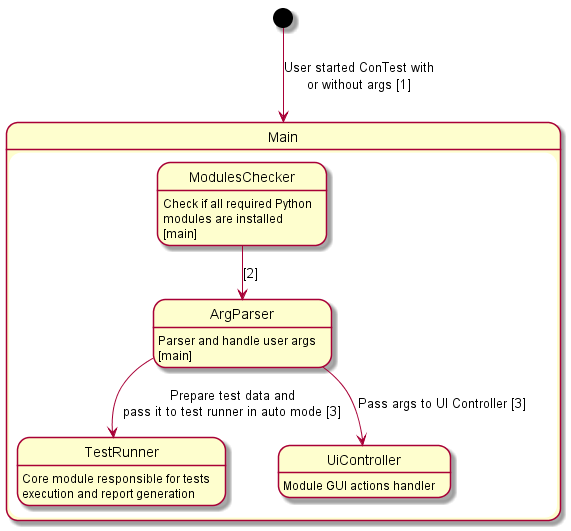
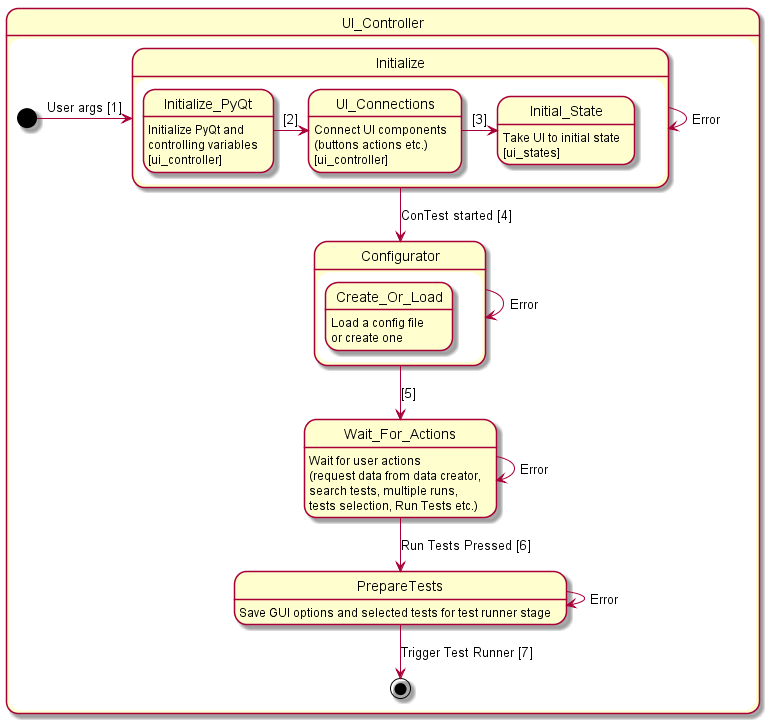
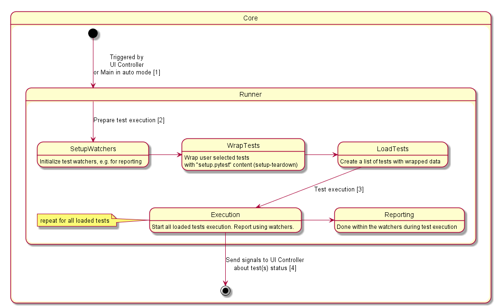
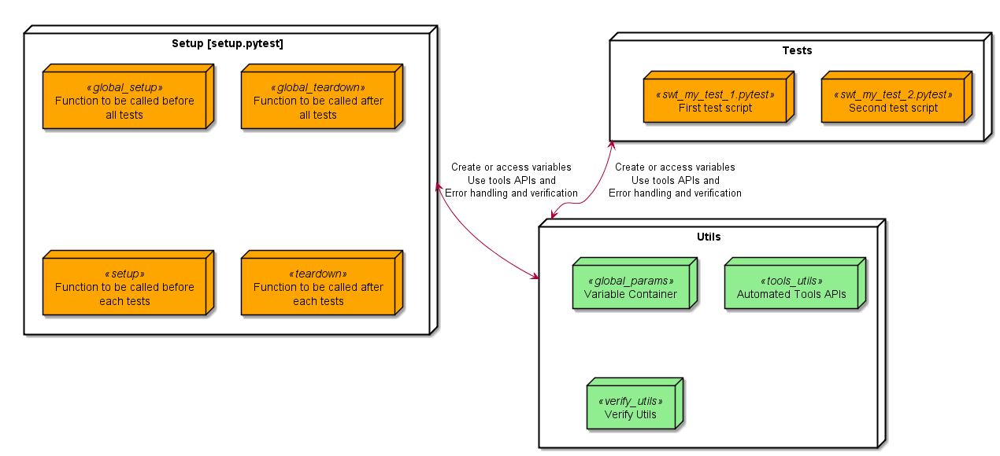
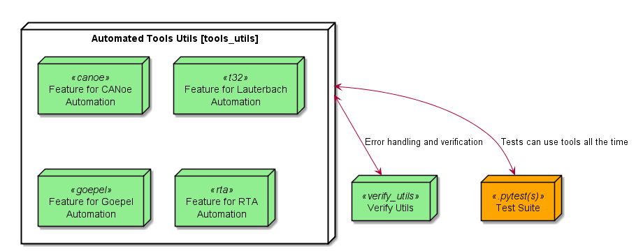

.. This file describes the Architecture and Design of ConTest

Architecture and Design
=======================

In this chapter the Architecture and Design of the ConTest  will be explained. |br|

Architecture
************

Architecture of ConTest is kept simple with separate components responsible for handling specific tasks. |br|
Following is an overview of 6 major components: |br|

+--------------------+-----------------------------------------------------------------------+
|      Component     |                                Description                            |
+====================+=======================================================================+
| Main               | For handling command line interface and passing args to UI controller |
+--------------------+-----------------------------------------------------------------------+
| UI Controller      | For handling user interface (tests display, configure paths etc.)     |
+--------------------+-----------------------------------------------------------------------+
| Data Creator       | For creating or preparing test data (paths, tests objects etc.)       |
+--------------------+-----------------------------------------------------------------------+
| Test Runner (Core) | For making arrangements of tests execution and generation of reports  |
+--------------------+-----------------------------------------------------------------------+
| Tests Suite        | Created by testers in which tests will be written                     |
+--------------------+-----------------------------------------------------------------------+
| Verify Utils       | Verification utilities for error handling and error reporting         |
+--------------------+-----------------------------------------------------------------------+
| Tools Utils        | Automated tools utilities ready to be used in Test Suites             |
+--------------------+-----------------------------------------------------------------------+

Components Design/Control Flow
******************************

The individual components design is explain with state diagrams below.

Main
~~~~

Main is responsible for module installations and arguments parsing

UI Controller
~~~~~~~~~~~~~

UI Controller for handling all UI actions.

Data Creator
~~~~~~~~~~~~

Data Creator is responsible for preparing data required by test runner.
This is a passive module which can be used by GUI Controller or Main modules based on request.

Core
~~~~

Core is responsible for test wrapping with setup data and controlling tests execution.

Test Suite
~~~~~~~~~~

Test suite has to be created by user (tester) in which test scripts and setup file will be placed. |br|
Setup file **(setup.pytest)** contains functions to be called before and after all or individual tests. |br|
Test files **(swt_my_test.pytest)** contains actual test cases. |br|
User can create as many files as he/she wants.

In setup file user can create variables using **Global Param** module. |br|
These variables can be accessed in **Setup** as well as in **Test** files. |br|

Tools Utils
~~~~~~~~~~~

Tools utils is developed as a feature component. |br|
Each tool is a feature which is developed as an independent component. |br|
Idea behind this feature approach is to make these utils available to be used outside ConTest. |br|
In order to use these features user has to simply **import** the tool scripts in their setup, tests or normal Python files. |br|

.. note::
    Since development of this component is kept independent therefore it opens the doors for others (outside ConTest teams)
    to contribute to existing features or add a new feature.

Execution Sequence in GUI Mode
******************************

Following sequential diagram explains the overall working of ConTest.

.. image:: seq.png

.. |br| raw:: html

     

