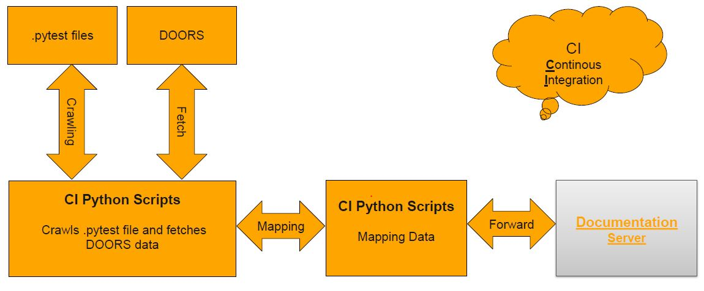

.. This file contains answers of some Frequently Asked Questions (FAQs)

FAQs
====

Following are answers of some frequently asked questions:

What is ConTest?
****************

ConTest is a framework for software requirement and integration testing in HIL and SIL environment. |br|
ConTest main focus is on ease of test cases execution, documentation and reporting
along-with with a well defined way of writing test cases in Python scripts making use of
automated tool APIs.

How can I use ConTest for new project?
**************************************

Read How_To_Use_

How to write tests in ConTest?
******************************

Read How_To_Use_

How much Python knowledge is required?
**************************************

You don't need to be an expert in Python to write tests in ConTest. |br|
With some basic Python scripting knowledge and using Tools APIs examples you can start
writing test cases. |br|

How to start ConTest?
*********************

Read How_To_Run_

Where reports are generated by ConTest?
***************************************

ConTest generates reports in 4 formats (HTML, TXT, JSON and XML). |br|
Reports are generated in the folder user mentioned when new config was created.

Can I monitor the status of tests?
**********************************

Yes, tests status can be monitored in following ways:

    - On GUI (with test status signals)
    - On Console
    - Summary report and Individual test reports are generated by framework

How can I use ConTest GUI?
**************************

ConTest GUI is user friendly. Guidelines for performing actions on GUI are displayed on message area
which helps users to navigate through options easily. Information regarding GUI options
(buttons, checkboxes etc.) can be seen by hovering mouse over options. |br|
Framework is performing error checks on each user option and prompting user in many ways (on console,
on GUI message area, with pop-up messages). |br|

How tests traceability is done in ConTest?
******************************************

With the help of some reporting functions ConTest records test documentation data.
Test documentation can be performed using DETAILS, TESTSTEP, VERIFIES etc. reporting functions.

Continuous Integration (CI) reporting tool is responsible to parse .pytest file and upload traceability data to server.

Can I run ConTest on Ubuntu?
****************************

Yes ConTest runs on Ubuntu as well. |br|
Keep in mind if you want to use a tool e.g. CANoe which is not supported on Ubuntu platform then
you will face issues.

What if I need help more help in test case creation?
****************************************************

You can contact ConTest development team CIP Rhino Team or watch our training videos_.

Why errors are not reported properly using ConTest verification APIs?
*********************************************************************
Check if you are importing ConTest tool modules properly.
Use following importing schema in *.pytest* or *.py* files for importing tool modules::

    # PTF or custom import area
    # NOTE : ALWAYS IMPORT (contest_expects, contest_asserts, report and get_parameter) AS BELOW.
    #        FOR PROPER DOCUMENTATION AND ERROR REPORTING
    from contest_verify.verify import contest_asserts
    from contest_verify.verify import contest_expects
    from ptf.ptf_utils.report import *
    from ptf.ptf_utils.global_params import get_parameter

Not able to connect to T32 in ConTest?
**************************************
For solving this issue make sure you have added remote API settings in your **config.t32** file.
Following lines must be added in your **<t32_installation_path>\\config.t32** file. |br|

.. note::
    You must add an empty line before and after these lines.

.. code-block:: text

    ; Remote API settings
    RCL=NETASSIST
    PACKLEN=1024
    PORT=20010

For more information read Lauterbach_

Can I share ConTest config files with others?
*********************************************

Yes you can share configuration file with others. |br|
Its recommended that for a project users shall decide beforehand about locations which can
be mentioned at the time of new configuration creation. |br|
In-case someone is not having same locations then **-l** command line option can be used to change
the base location. |br|
You can also edit the paths in ConTest configuration file using **Menu->Edit Config** option from GUI. |br|
For more information read section of using **-l** option in How_To_Run_

How to request a new feature for ConTest?
*****************************************

Checkout `Create Feature Request`_

How to report a bug?
********************

Checkout `Create Bug Report`_

Why test are written in .pytest extension?
******************************************

This is a customized extension for documentation purpose. Don't confuse it with 'pytest' python module.
Scripts with .pytest extension are normal python script inside ConTest.
Continous Integration (CI) parses these scripts and take data from reporting tags (DETAILS, VERIFIES, TESTSTEP etc.)
and store them for documentation and traceability purpose.

Can I run or execute T32 PRACTICE scripts in ConTest?
*****************************************************

Yes, you can execute T32 PRACTICE scripts in ConTest. |br|
You can either use T32 API **run_t32_script** to execute your script or if your script is written as
test case then you can select that script on ConTest GUI. |br|
For later case refer to T32_Script_Tests_. |br|
In order to select CMM test cases on GUI you should mention CMM test scripts location in ConTest configuration.

Can I run CANoe test modules in ConTest?
****************************************

Yes, you can run CANoe Test Modules (xml modules or DIVA generated) in ConTest. |br|
You should mention the location of these modules in CAPL test location field in ConTest configuration. |br|
The test modules will be shown on ConTest GUI (similar to CANoe test module view) for selection. |br|
You can select which test module or test case to run or execute and press **Run** on ConTest GUI
for execution. |br|
ConTest will monitor the execution status of test modules and report status on console. |br|
For details read  CANoe_Test_Modules_ chapter.

How can I include ConTest into my CI build (e.g. Jenkins)?
**********************************************************

Please check the :doc:`./ci_integration/ci_integration` chapter.

.. _How_To_Use: using_ptf/using_ptf.html
.. _How_To_Run: how_to_run.html
.. _Lauterbach: api_doc/contest_lauterbach.lauterbach.html
.. _videos: https://eu.artifactory.conti.de/artifactory/c_adas_astt_generic_prod_eu_l/ConTest/Training/
.. _Feature Request: https://jira-adas.zone2.agileci.conti.de/secure/CreateIssueDetails!init.jspa?pid=10200&issuetype=11000&priority=3
.. _Bug Ticket: https://jira-adas.zone2.agileci.conti.de/secure/CreateIssueDetails!init.jspa?pid=10200&issuetype=10004&priority=3
.. _T32_Script_Tests: special_cases/special_cases.html#running-t32-practice-scripts
.. _CANoe_Test_Modules: special_cases/special_cases.html#running-capl-test-modules
.. _Create Feature Request: create_request.html#create-feature-requests
.. _Create Bug Report: create_request.html#create-problem-report

.. |br| raw:: html

     

