.. This file describes how a set PyCharm IDE

PyCharm Setup
=============

PyCharm is a very nice IDE for working with Python. |br|
You can use this IDE for development of Python code as recommendation. |br|
Install PyCharm via Employee Self Service. |br|

.. note::
    Please feel free to use any IDE of your liking for development.

In this chapter, we will setup PyCharm.

Set-Up
******

.. note:: PyCharm Professional version can be requested via Continental employee self service.

Create project
**************
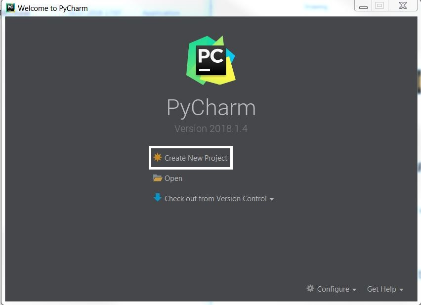

.. image:: images/create_prj_1.1.JPG

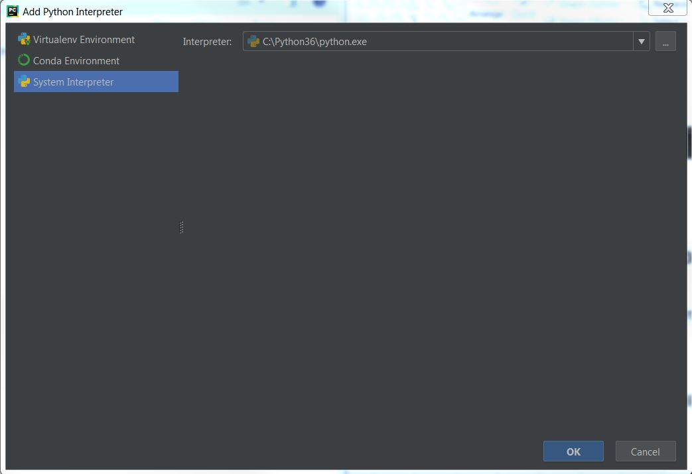

PyCharm Settings
****************
After adding ConTest as project, Now we will configure settings

.. note::
    Press CTRL+ALT+S to open settings and then follow screenshots

Removing Tab
~~~~~~~~~~~~
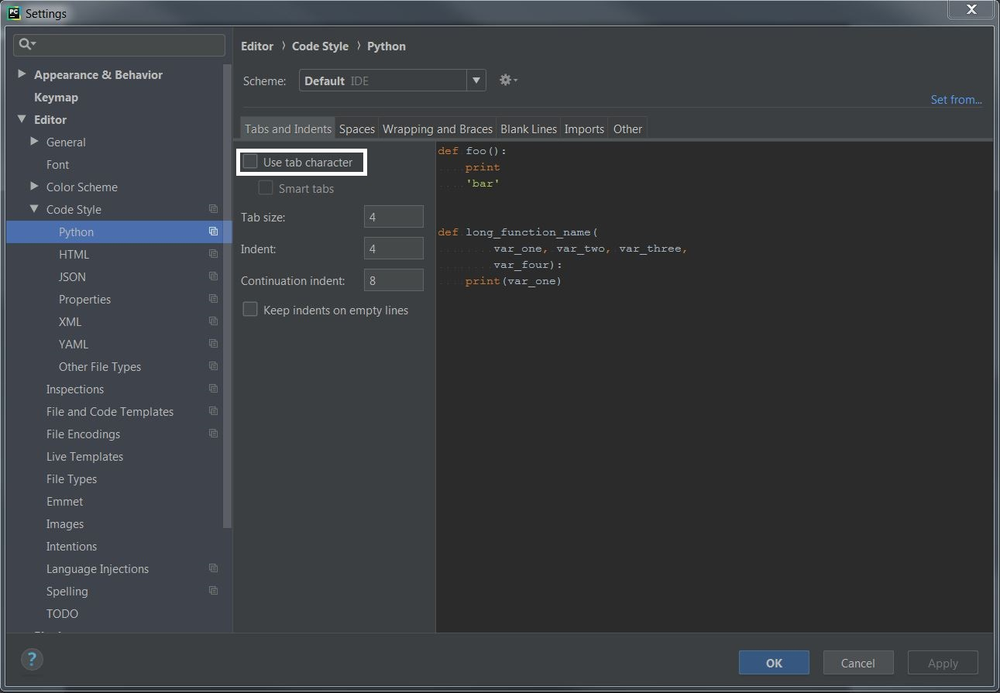

Line Marker
~~~~~~~~~~~
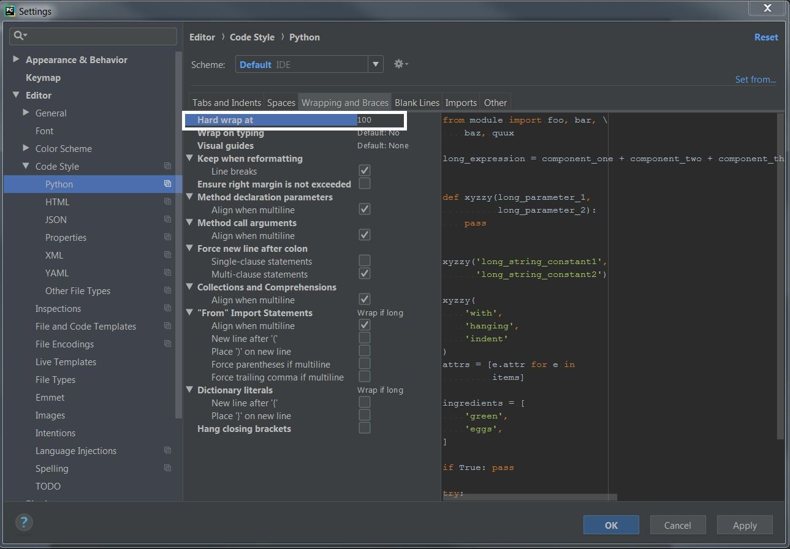

PEP8 Set-up
~~~~~~~~~~~
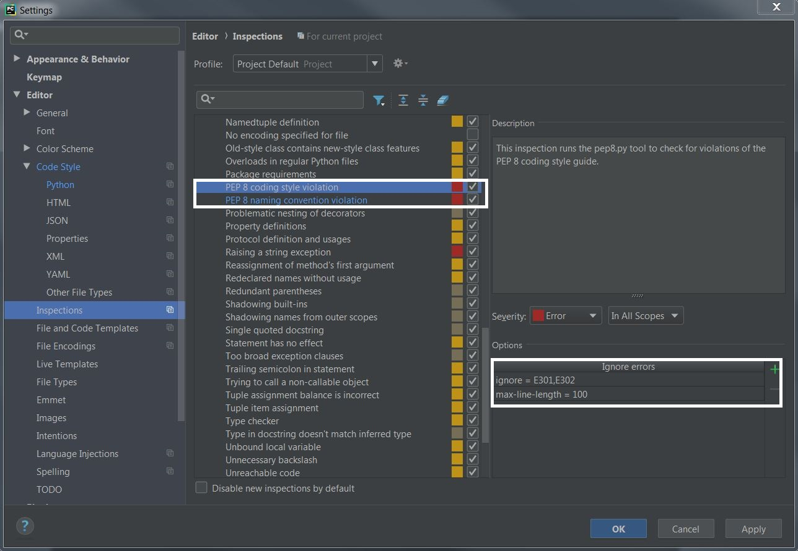

File Type
~~~~~~~~~
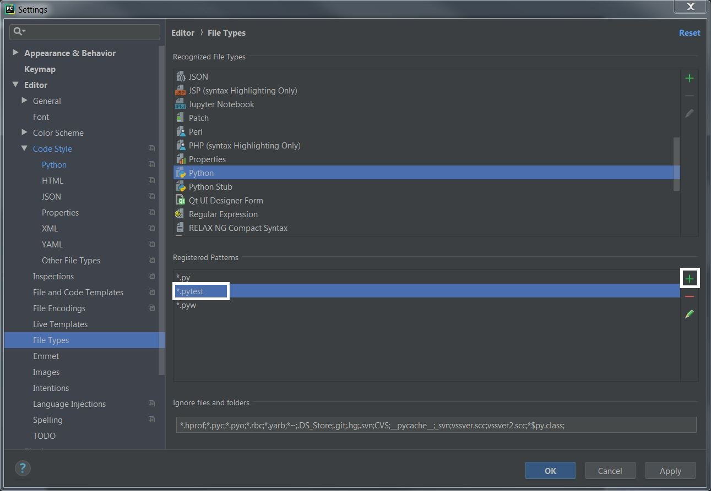

Trail Spaces
~~~~~~~~~~~~
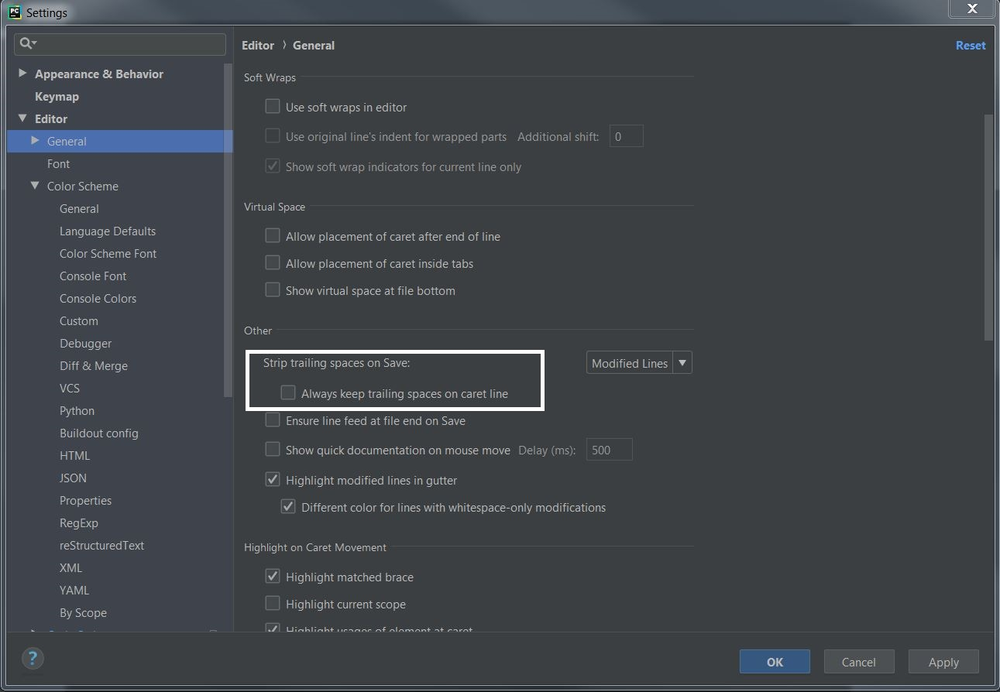

Adding Sources
~~~~~~~~~~~~~~
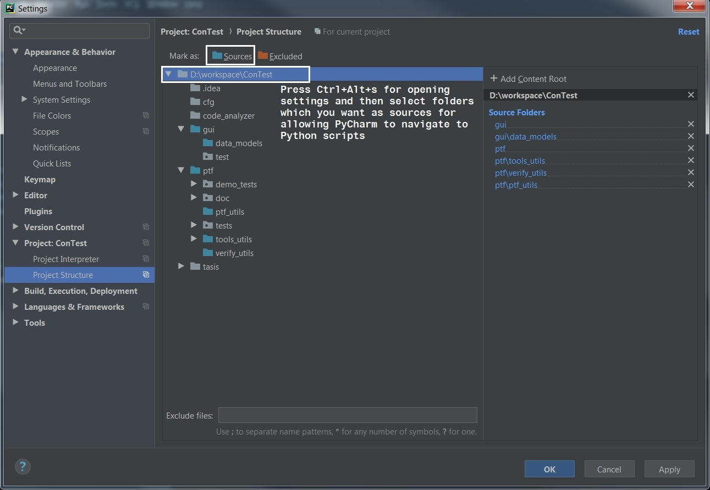

Add Project Folder
~~~~~~~~~~~~~~~~~~
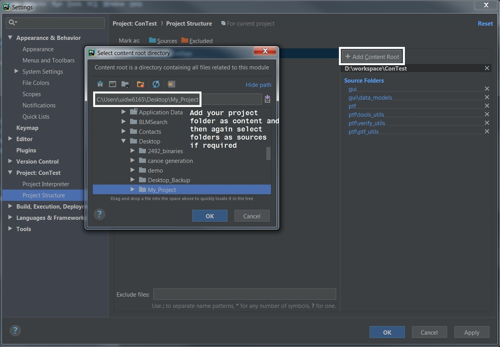

PyLint
~~~~~~
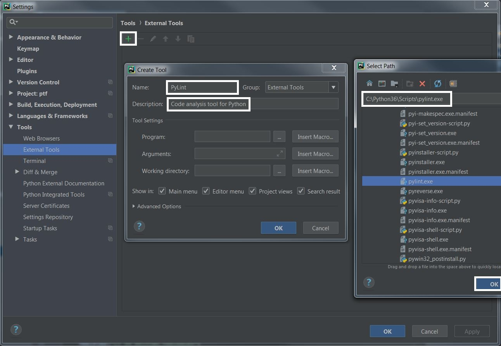

.. note::
    Add following line in Argument option while adding PyLint as external tool |br|
    **pylint.config** can be found in *ConTest\\code_analyzer*

Example::

    --rcfile=path_to_pylint_config $FilePath$

PycodeStyle
~~~~~~~~~~~
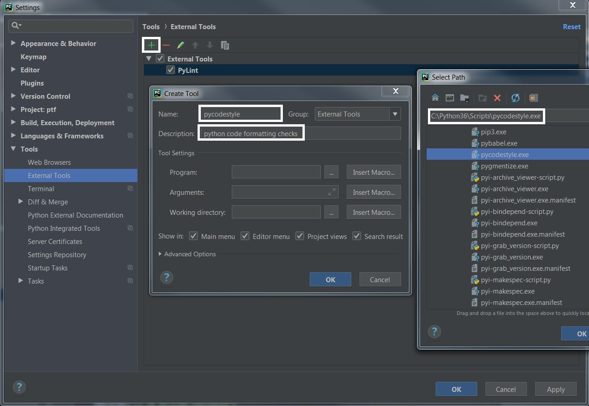

.. note::
    Add following line in Argument option while adding Pycodestyle as external tool |br|
    **pep8.config** can be found in *ConTest\\code_analyzer*

Example::

    --config=path_to_pep8_config $FilePath$

.. |br| raw:: html

     

