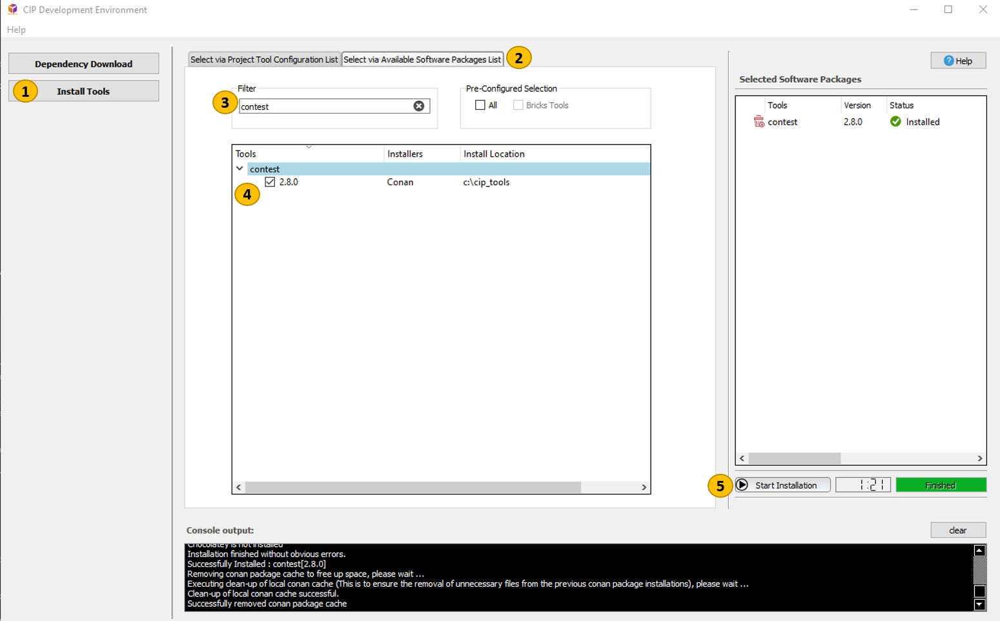

.. This file describes how a user can install Python 3.6 packages used by ConTest

Installations
=============

In order to use ConTest, you need to do some installations.

* ConTest is developed in Python v3.9 therefore first of all you, user need to install Python v3.9

General Installation
********************

On Windows:
-----------

    - Get Admin rights on your machine.
    - Install Python 3.9 from `Employee Self Service`_
    - Read :ref:`Getting Release` chapter to get release
    - Simply start ``main.py``

        ..  code-block:: batch

            cd <contest_release_folder>
            <python_exe_absolute_path> main.py

    - Read :ref:`How To Run` chapter to understand how to run the framework

On Windows (via Python VENV):
-----------------------------

You can create a **Python Virtual Environment** ✨ and use it to run ConTest tool. |br| |br|
Using **Python Virtual Environment** ✨ your system Python which you installed via `Employee Self Service`_ will be clean. |br|

- Create **Python Virtual Environment** ✨ for ConTest at ``D:\contest_venv``.

  .. note::
    Please note that ``D:\contest_venv`` location is just an example, so feel free to create venv on any location you like 😀

  ..  code-block:: batch

    <python_installation_path>\python.exe -m venv D:\contest_venv

- Start **ConTest**

  ..  code-block:: batch

    cd <contest_release_folder>
    D:\contest_venv\Scripts\python.exe main.py

On Ubuntu:
----------

    - Get Admin rights on your machine.
    - Ubuntu machine (Physical or Virtual from Continental) comes with **Python 3** installation therefore no need to install Python.
    - Read :ref:`Getting Release` chapter to get release
    - Run following commands in terminal inside ConTest root directory to install required Python modules to run the framework

        Example::

            $ cd <contest_release_folder>
            # installing python modules in a specific Python interpreter
            $ ./install_pip_user_dependencies.sh

    - Read :ref:`How To Run` chapter to understand how to run the framework

Installation via Conan
**********************

.. note::
    This way of installation will be helpful for users who are already familiar with CIP DevEnv Tool.

ConTest Conan package can be installed via **CIP DevEnv Install Tools** feature by following steps as below:

Pre-Requisite:
--------------

- Access to `Conti Conan Artifactory`_

.. note::
    If you don't have access then please create a ticket following instructions `here`_

Get CIP DevEnv
--------------

1. Download `dev_env_ctl.exe`_
2. Open Windows Powershell in download location
3. Run ``dev_env_ctl.exe update``
4. Run ``dev_env_ctl.exe open-gui``

Install ConTest Conan Package
-----------------------------

1. Click **Install Tools**
2. Move to **Select via Available Software Packages List**
3. Search for **contest**
4. Select version
5. Click **Start Installation**

Installation Location:
----------------------

*C:\\cip_tools\\contest\\*

.. _Employee Self Service: https://ssp.auto.contiwan.com/SSP6
.. _here: https://confluence.auto.continental.cloud/x/QfVXOQ
.. _Conti Conan Artifactory: https://eu.artifactory.conti.de/artifactory/c_adas_cip_conan_I/3rdparty/
.. _dev_env_ctl.exe: https://github-am.geo.conti.de/ADCU-CIP/dev_env/releases/latest/download/dev_env_ctl.exe

.. |br| raw:: html

     
