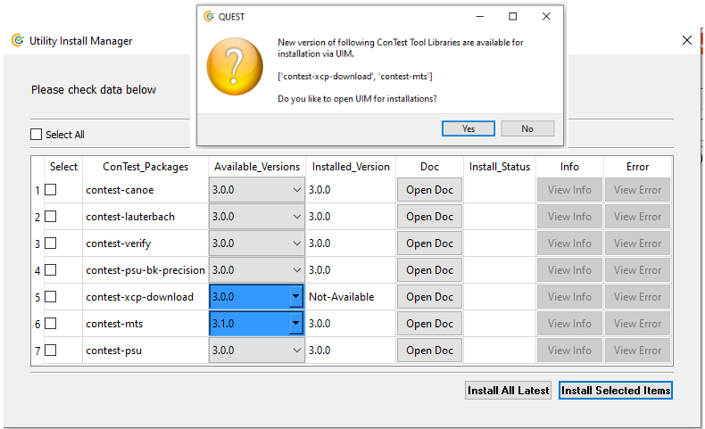
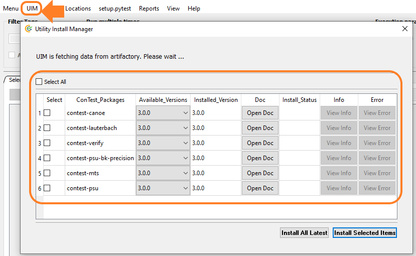
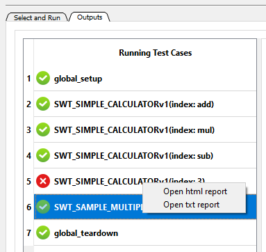

.. This file contains ConTest releases log

Release Notes
=============

Release history is mentioned below:

Release v3.3.0
**************

Release Date **19-04-2024** |br|

Features/Changes:
-----------------

⚡ New HTML Summary Report Look
###############################

A new look for the HTML summary report generated by ConTest has been introduced. |br|
Further improvements will be done in upcoming releases.

⚡ TESTTAG Filter Logic Selection via GUI
########################################

Now users can select the filter selection logic for **TESTTAG** values via the GUI. |br| |br|
The ``AND``, ``OR`` logic can be applied over selected **TESTTAG** values and respective tests shall be displayed based on
**TESTTAG** filter logic.

⚡ Run Execution Record
######################

Details 👉 `Run Execution Record`_

TAF Helper Changes
##################

- Added TestType "FLASHING_SCP" in taf_custom_event_helper | Ticket: `CIP-25545`_
- Add new FLASHING_PCAT | Ticket: `CIP-25054`_
- Add CANoe tests to white list separately | Ticket: `CIP-25487`_
- Move XMLParser custom event functions | Ticket: `CIP-25537`_
- Fix for running ConTest locally | Ticket: `CIP-25648`_
- Use the new function for closing Canoe | Ticket: `CIP-25516`_

🐛 Fixes:
---------

- Disable error pop-ups in auto_gui mode | Ticket: `PMTJSD-229771`_

Release v3.2.0
**************

Release Date **26-02-2024** |br|

Features/Changes:
-----------------

🚀 ``--uim`` Requirements File Option
#####################################

Now install Python libraries via ``--uim`` command line option.

.. code:: python

    # install libraries mentioned in given requirements file
    <python_exe> main.py --uim my_pip_reqs.txt

Details at `Get Specific Libraries`_

🚀 Update in CHiLIS ``chilis_remote_sim`` API
#############################################

`chilis_remote_sim`_ API will now return CHiLIS process ID

🚀 Tool Libraries available as Python Wheel
############################################

`Available ConTest Python Libraries`_

Install available libraries:

  - `Utility Install Manager`_ (UIM) options
  - Or simply via ``pip install contest_<tool_lib_name>==<x.y.z>``

TAF Helper Changes
##################

  - ``custom_events`` method in ``taf_helpers`` | Ticket: `CIP-24871`_
  - Add support for SDF erase (recovery + flashing testsuite) | Ticket: `CIP-25167`_
  - TSFlash duration issue workaround | Ticket: `CIP-25326`_
  - Custom event helper for projects that don't use cip_utils | Ticket: `CIP-25053`_
  - Added missing Python libs to taf_utils | Ticket: `PMTJSD-217440`_
  - Implement function for closing Canoe | Ticket: `CIP-25348`_
  - Added parameter ``force_wait_timeout`` to function ``run_t32_script`` | Ticket: `CIP-25305`_

🐛 Fixes:
---------

- Handling invalid values given in ``TESTTAG`` reporting function | Ticket: `PMTJSD-195566`_
- UIM feature fixes for fetching correct ConTest Python Libraries from artifactory along-with their versions
- Fixes related to Kyverno policies related to ConTest run in docker containers
- Raising error if an unsupported type of param test arg is given
- Fix for KeyError when ``TESTTAG`` spans over multiple lines | Ticket: `PMTJSD-219715`_

Release v3.1.0
**************

Release Date **09-11-2023** |br|

Features/Changes:
-----------------

🚀 contest_mts 👉 v3.1.0
#########################

  - `get_signals_value`_ API usage for MTS online (with MI4/5) and offline (rrec playback)
  - fix for opening MTS  on remote machine (MI4/5) using ps tool for first time

🚀 contest_xcp_download 👉 v3.0.0
##################################

  - ConTest ``xcp_download`` library available as Python wheel package.

        .. note::
                Recommended to change ``xcp_download`` import from ``from contest_xcp_download.xcp_download.xcp_download import xcp_download``
                to ``from contest_xcp_download.xcp_download import xcp_download``
  - New API `xcp_connect`_

🚀 New API ``get_current_test_info``
####################################

Details at `get_current_test_info`_

.. code-block:: python
    :emphasize-lines: 2, 18-23, 26

    from ptf.ptf_utils.report import *
    from ptf.ptf_utils.global_params import get_current_test_info

    def SWT_MY_AWESOME_TESTv1():
        DETAILS("Normal demo test")

        PRECONDITION("NA")

        VERIFIES("SWT_NORMAL_TEST_REQ_1")
        VERIFIES("SWT_NORMAL_TEST_REQ_2")

        AUTOMATES("SWT_NORMAL_TEST_ID")

        TESTTAG("normal")
        TESTTAG("sil")

        # fetching meta-data
        test_info = get_current_test_info()
        automates_id = test_info.automates  # returns ["SWT_NORMAL_TEST_ID"]
        details = test_info.details  # returns ["Normal demo test"]
        precondition = test_info.precondition  # returns ["NA"]
        tags = test_info.tags  # returns ["python", "normal", "sil"]
        verified_ids = test_info.verified_ids  # returns ["SWT_NORMAL_TEST_REQ_1", "SWT_NORMAL_TEST_REQ_2"]

        # check further attributes of ``test_info`` and then access them as above if necessary
        print(dir(test_info))

        ...

🔔 Notification for ConTest Python Libs Releases
################################################

Now users will get notified 🔔 about new versions of **ConTest Python Tool Libraries** ✨

🧾 Run ConTest via Python VENV
##############################

Please check `On Windows (via Python VENV)`_

TAF Helper Changes
##################

  - Solution for the auto-programming timeout bug | Ticket: `PMTJSD-211733`_

👀 Fixes:
---------

- Fixed ``You're not on Continental Network`` issue
- Fixed getting ConTest tool version properly via ``git``

Release v3.0.0
**************

Release Date **27-10-2023** |br|

Features/Changes:
-----------------

Utility Install Manager
#######################

Check details at `Utility Install Manager`_ (UIM)

With introduction of **UIM** following tool libraries or utilities are available as Python wheel packages. |br|
These libraries will be automatically installed if you're using them already in your test scripts.

.. note::
        Although backward compatibility is ensured which means users don't need to make any changes however we recommend users
        to adapt to new way of importing above tool utils or libraries in their test scripts.

- ``from ptf.tools_utils.canoe import canoe`` -->  ``from contest_canoe import canoe`` |br|
- ``from ptf.tools_utils.lauterbach import lauterbach`` -->  ``from contest_lauterbach import lauterbach`` |br|
- ``from ptf.tools_utils.mts import mts_ctrl`` -->  ``from contest_mts.mts import mts_ctrl`` |br|
- ``from ptf.tools_utils import psu`` -->  ``from contest_psu.psu import psu`` |br|
- ``from ptf.tools_utils.psu_bk_precision import bk_168xx`` -->  ``from contest_psu_bk_precision import bk_168xx`` |br|
- ``from ptf.verify_utils import ptf_asserts`` -->  ``from contest_verify.verify import contest_asserts`` |br|
- ``from ptf.verify_utils import ptf_expects`` -->  ``from contest_verify.verify import contest_expects`` |br|
- ``from ptf.verify_utils import contest_warn`` -->  ``from contest_verify.verify import contest_warn`` |br|

Installing Modules Automatically
################################

No need to run ``install_pip_user_dependencies.bat`` if some Python modules required to run ConTest tool are missing. |br|
Once you start the tool via ``main.py`` they will be installed automatically.

New CANoe APIs
##############

  - `activate_deactivate_measurement_block`_
  - `start_stop_logging`_
  - `change_log_file_name`_
  - `log_file_name_options`_
  - New ``verify`` argument in `change_system_variable`_

Tickets: `PMTJSD-205561`_ | `PMTJSD-208095`_

Fixes:
------

- Fixed execution of tests if ``global_setup`` function fails.

Release v2.9.0
**************

Release Date **27-09-2023** |br|

Features/Changes:
-----------------

Tests Skipping Decorator
########################

- Check details at `Skip Decorator`_
- `Skip Decorator Demo Tests on GitHub`_
- Find demo tests locally at **v2.9.0\\ptf\\demo_tests\\skip_tests**

View Reports
############

Right click on a specific test case on output GUI tab in order to view reports.

LINK Report API
###############

Report function for hyperlinking any file in Test Case Execution Sequence for easy navigation in HTML report.

.. note::
    The file which is linked via ``LINK`` function which will be copied to report folder with timestamp so link always work.

.. note::
    ``LINK`` function is used internally in `run_test_module`_, `run_test_cfg`_ and `run_test_cfgs`_ CANoe APIs in order to
link HTML reports generated by CANoe tool to ConTest generated HTML report.

.. code-block:: python
        :emphasize-lines: 1, 6-7

        from ptf.ptf_utils.report import LINK

        def SWT_MY_AWESOME_TESTv1():
            ...

            # making a hyperlink in `SWT_MY_AWESOME_TESTv1` test html report of a file `output.json`
            LINK("D:\\demo\\output.json")

            ...

CTF Tests in CatHat XML Report
##############################

Now CTF (CANoe Test Framework) generated test cases in a test module sections along-with their verdict information ``PASS, FAIL``
will be available in ``CatHat XML`` report.

Tickets: `PMTJSD-198505`_

ConTest Conan Package
#####################

ConTest can now be installed via Conan using CIP DevEnv tool documented at `Conan Installation`_. |br|
The ConTest Conan Package is also available in Windows image which is used in Jenkins build using ``windows`` node. |br|
You can use ConTest Conan package in Jenkins pipeline as below:

.. code-block:: groovy

    node("windows") {
        stage('run_contest') {
            powershell """
            C:\\cip_tools\\contest\\2.8.0\\contest_venv\\Scripts\\python.exe C:\\cip_tools\\contest\\2.8.0\\main.py <cli_args>
            """
        }

Tickets: `PMTJSD-166524`_

Updates in ``cip_run.py``
#########################

``cip_run.py`` script is used in ConTest tool configuration in order to execute the tool in Bricks Build System. |br|
Details can be checked in `CI Integration`_ chapter.

Fixes:
------

- Fixed missing default ``setup.pytest`` script.
- Fix in Siglent power supply script.
- Fixed issue related to missing ``metadata_files`` folder in external report folder given via ``--report-dir`` CLI option.
- Fixed first time usage banner pop-up for ``pstools`` in MTS tool utility.

Release v2.8.0
**************

Release Date **25-08-2023** |br|

Features/Changes:
-----------------

Siglent Power Supply APIs
#########################

- `Siglent Power Supply APIs List`_
- `Siglent Power Supply Demo Tests on GitHub`_
- Find demo tests locally at **v2.8.0\\ptf\\demo_tests\\psu\\siglent_spd1305x**

Get Verdicts Of All Tests
#########################

Now use `get_test_verdict`_ to get verdicts of all tests.

.. code-block:: python
        :emphasize-lines: 1, 4, 6

        from ptf.ptf_utils.global_params import get_test_verdict

        # getting verdicts of all tests
        all_test_verdict = get_test_verdict()
        # getting test verdict of "SWT_MY_TESTv1" test case
        test_verdict = get_test_verdict("SWT_MY_TESTv1")

IMAGE Reporting Function
########################

With the use of ``IMAGE`` reporting API, users can add image files with extensions ``".gif", ".jpg", ".jpeg", ".svg", ".png", ".bmp"``
as normal image within test steps of the test case as shown below:

.. code-block:: python
        :emphasize-lines: 1, 5

        from ptf.ptf_utils.report import IMAGE

        def SWT_MY_TESTv1():
            ...
            IMAGE(<my_img_path>)
            ...

Tickets: `PMTJSD-170021`_

Linking CANoe HTML Reports in ConTest HTML Report
#################################################

Now CANoe APIs `run_test_module`_, `run_test_cfg`_ and `run_test_cfgs`_ will automatically link the respective test
reports generated by CANoe for test modules or test configuration as hyperlink in ConTest HTML report in which these
CANoe APIs shall be used.

Tickets: `PMTJSD-178953`_

Fixes:
------

- Fixed CTF Tests Run | Tickets: `PMTJSD-197736`_

Release v2.7.0
**************

Release Date **08-08-2023** |br|

Features/Changes:
-----------------

Custom Setup & Teardown Decorator
#################################

- Check details at `Custom Setup & Teardown Decorator`_
- `Custom Setup & Teardown Demo Tests on GitHub`_
- Find demo tests locally at **v2.7.0\\ptf\\demo_tests\\custom_setup**

Tickets: `PMTJSD-156059`_

Voetsch Temperature Chamber APIs
#################################

- `Voetsch Temperature Chamber APIs List`_
- `Voetsch Temperature Chamber Demo Tests on GitHub`_
- Find demo tests locally at **v2.7.0\\ptf\\demo_tests\\voetsch_vt7004**

Tickets: `PMTJSD-172547`_

Softing DTS Monaco SDA APIs
###########################

- `Softing DTS Monaco SDA APIs List`_
- `Softing DTS Monaco SDA Demo Tests on GitHub`_
- Find demo tests locally at **v2.7.0\\ptf\\demo_tests\\dts_sda**

Report Disclaimer for Param Tests Modified Values
#################################################

Check details at `Invalidity Scenarios`_

Adding Metadata Files Per Param Test Set
########################################

Now `add_meta_data_links_to_reports`_ usage in parameterized tests will add meta-data files per individual set.

Fixes:
------

- Version info pop-up disabled in ``-r auto_gui`` mode | Tickets: `PMTJSD-190103`_
- Test runner of T32 and CANoe test modules
- Unblocking the execution of ``install_pip_user_dependencies.bat`` script for automated scenarios (e.g. conan package creation)

Release v2.6.0
**************

Release Date **06-07-2023** |br|

Features/Changes:
-----------------

License Compliance Review (LCR) Activity
########################################

**License Compliance Review (LCR)** has been performed with the help of **Open Source Compliance Audit Review (OSCAR)** team.
**LCR** is a compliance check to identify potential **FOSS (Free & Open Source Software)** license issues in ConTest.

As a result of **LCR** review following changes are done in ConTest tool in order to avoid any license issues:

  - Signal Evaluation ``sig_eval`` tool utility removed due to usage of a python module having **FOSS license compliance** issue.
  - `generate_mdf_file`_ API deprecated in ``mts_ctrl.py`` script
  - `NOTICE_FILE.txt`_ addition

Add Sets Via Param Window
#########################

Check details at `Add New Sets via GUI`_

Tickets: `PMTJSD-155687`_

INCONCLUSIVE Verdict
####################

The verdict in previous release ``PASS WITH WARNINGS`` is changed to ``INCONCLUSIVE`` to keep the consistency with test process.

 .. note::
        ``INCONCLUSIVE`` verdict shall be marked as ``FAILED`` in **Junit XML** and **CatHat XML** reports due to unavailability of this verdict in their schemas.

ODIS Interface Selection Support
################################

ODIS Tool Utility updated in order to support the selection of different communication interface e.g. ``canfd, doip``.
Demo tests can be with following links:

  - `ODIS CAN-FD Demo Test`_ | **Release Location: ConTest/ptf/demo_tests/odis_via_can_canfd**
  - `ODIS DoIP Demo Test`_ | **Release Location: ConTest/ptf/demo_tests/odis_via_doip**

Tickets: `PMTJSD-131814`_

New XCP Download API
####################

New API for making an attempt to flash multiple times if error occurred.

  - `xcp_download_with_retry`_

New CANoe APIs
##############

New APIs related to Test Configuration.

  - `enable_disable_test_cfg`_
  - `get_test_unit_variant`_
  - `set_test_unit_variant`_

Tickets: `PMTJSD-155858`_ | `PMTJSD-155828`_

New Arguments for MTS Utility
#############################

New **optional** arguments for `MTS controller class`_ constructor

  - ``localhost`` *provide localhost explicitly via string e.g.* ``localhost=127.0.0.1``

    .. code-block:: python
        :emphasize-lines: 2

        # proving localhost explicitly if "localhost" string is not mapped to "127.0.0.1" ip
        mts_app = mts_ctrl.MtsCtrl(<mts_application_path>, localhost="127.0.0.1")

  - ``proxies`` *for sending requests to MTS via proxies e.g.* ``{"http": "http://a.b.c.d:e", "https": "https://g.h.i.j:k"}``

    .. code-block:: python
        :emphasize-lines: 2

        # proving proxies via `proxies` argument in form of dictionary
        mts_app = mts_ctrl.MtsCtrl(<mts_application_path>, proxies={"http": "http://a.b.c.d:e", "https": "https://g.h.i.j:k"})

Tickets: `PMTJSD-180824`_ | `PMTJSD-180826`_

Param Tests Set Names in Run View
#################################

Now Parameterized Test along-with their set names or indices shall be visible on output tab for better navigation to test output on console view.

.. image:: images/param_sets_names_view.png

Prompting user about usage of unofficial ConTest version
########################################################

Now users shall be informed with the help of a message if it's detected that an unofficial tool version is used.
This implementation has been done to actively prompt user about unofficial usage and switch to an official version.

TESTCASE_ID Reporting Tag Removed
#################################

``TESTCASE_ID`` tag removed which was introduced in ``v2.5.0`` release as ``AUTOMATES`` tag is exactly doing same.

TAF Helper Changes
##################

  - Support for CTF in TAF via ConTest | Ticket: `SVPT-23614`_

Fixes:
------

- ``pywin32`` or ``win32com`` import error
- Fixed ``--filter tag`` cli option usage with ``-r auto_gui`` cli option

Release v2.5.0
**************

Release Date **12-04-2023** |br|

Features/Changes:
-----------------

Warning APIs
############

  With warning APIs user can log warning(s) within tests which shall be saved in JSON, HTML and TXT tests.

  .. note::
        If only warning is logged in a test case then the verdict of that test shall be ``PASS WITH WARNING``.

  .. note::
        If there are no general failure or no test failed and there is at-least one test with ``PASS WITH WARNING``
        verdict then the overall exit code of contest will be ``3``.

  **ConTest Exit Codes:**

        - SUCCESS = 0       -> all tests passed and no error occurred
        - GENERAL_ERR = 1   -> if any general exception occurred
        - TEST_FAILURE = 2  -> if any one test case failed
        - WARNING_STATE = 3 -> if any one or more test case logged warning(s) and no other failure happened

  - `warn`_
  - `warn_if_eval_exp_failed`_

  Tickets: `PMTJSD-163327`_ | `PMTJSD-149868`_

MTS APIs New Arguments
######################

  New argument ``mts_cli_args`` in ``open_application`` and ``open_remote_application`` APIs.

  Use this option to provide additional MTS CLI arguments in form of list.

  - `open_application`_
  - `open_remote_application`_

  .. code:: python

    # opening MTS application with port 8181 with additional argument
    mts_ctrl_obj.open_application(local_port=8181, mts_cli_args=["-showminimized"])

  Tickets: `PMTJSD-156489`_

BK Precision PSU API name changes
#################################

  APIs name changed:

   - ``set_voltage``            --> ``set_operating_voltage``
   - ``set_current``            --> ``set_operating_current``
   - ``get_display_voltage``    --> ``get_output_voltage``
   - ``get_display_current``    --> ``get_output_current``

  Tickets: `PMTJSD-157757`_ | `PMTJSD-163334`_

Name Sets in Parameterized Tests
################################

  Option to name the parameterized tests set values which shall be used for naming tests in reports generated.

  Details at `Naming Parameters Sets`_

  Tickets: `PMTJSD-156067`_

RND 320-KD3000 Power Supply APIs
################################

  - `RND 320-KD3000 Power Supply APIs List`_
  - `RND 320-KD3000 Power Supply APIs Demo Test`_

  Tickets: `PMTJSD-149530`_

Load Program API in Cincinnati Environmental Chamber
####################################################

  - `check_chamber_status`_
  - `send_program`_

  Tickets: `PMTJSD-160193`_

Create Table APIs
#################

  New APIs which allow user to create a 2D table

  - `add_row`_
  - `get_table`_
  - `new_table`_
  - `print_table`_
  - `Create Table APIs Demo Test`_

CANoe property ``supress_save_cfg``
###################################

  This property if set to ``True`` then the modifications done in CANoe cfg shall be ignored when ``open_cfg`` API is used.

  This use-case is support scenario if a previously an unsaved configuration was left open, when we try to use ``open_cfg``
  we get a blocking GUI prompting us to save previous configuration.

Two New BSIG methods get_all() and save_df()
############################################

Terminate MTS with its corresponding PID
########################################

  Tickets: `GUILDS-2716`_

Feature To Run Un-selected/Un-saved Tests
#########################################

  CLI and GUI option to reverse the selection of test cases i.e. un-selected (in GUI case) or un-saved (in CLI case) tests shall run.

  - `CLI Reverse Test Selection Argument`_
  - Check GUI for this new option on top right corner

  Tickets: `PMTJSD-152810`_

New Reporting Function
######################

  Function for adding unique testcase id ``TESTCASE_ID`` which will be added in JSON and HTML reports.

  Tickets: `PMTJSD-157255`_

Generic API to add meta data files in HTML and JSON
###################################################

  New API `add_meta_data_links_to_reports`_ to add meta-data files in JSON as well as HTML test reports.

  .. note::

        `add_file_hyperlink_to_html_report`_ API will be deprecated in future therefore please make use of
        `add_meta_data_links_to_reports`_ API.

  Tickets: `PMTJSD-152810`_

TAF Helper Changes
##################

  - Read and evaluate return code from t32_api.T32_GetPracticeState() | Ticket: `SD-53152`_
  - Add ``run_canoe_tests`` function to ``taf_helpers.py``

Fixes:
------

- ODIS `send_raw_service_functional`_ API proper response handling for func ID msgs
- Doc update in `send_diag_cmd_via_id`_
- Running only failed param tests in GUI mode
- Fixed no. of loops tests run in auto_gui mode

Release v2.4.0
**************

Release Date **22-02-2023** |br|

Features/Changes:
-----------------

New ODIS APIs
#############

  - `send_raw_service_functional`_
  - `configure_odis_settings`_

  `send_raw_service_functional Demo Test`_

  Tickets: `PMTJSD-141804`_ | `PMTJSD-146527`_

B&K Precision Power Supply (1685B, 1687B, 1688B ) APIs
######################################################

  - `BK Precision APIs List`_

  `B&K Precision Power Supply Demo Tests`_

  ``enable_output,  get_current_limit,  get_device_status,  get_display_current,``
  ``get_display_voltage,  get_max_current,  get_max_voltage,  get_set_current,``
  ``get_set_voltage,  get_voltage_limit,  set_current,  set_current_limit,``
  ``set_voltage,  set_voltage_limit,  disable_output, close``

  Ticket: `PMTJSD-135198`_

ChiLis Remote API
#################

  New API `chilis_remote_sim`_ to start ChiLis simulation with given configuration and recording on remote host.

  `ChiLis Remote API Demo Test`_

  Ticket: `PMTJSD-145707`_

ZenZefi Updates
###############

  The login and logout support APIs for ZenZefi tool has been ended. |br|
  Due to terms and conditions of the ZenZefi tool, we are suppose to discontinue all login and logout related support.

  **APIs Removed:** ``login_offline, disable_autologout, enable_autologout, login, logout``

  .. note::
        Users can login to ZenZefi online portal once and select option to keep the login, in order to use remaining. |br|
        APIs `request_diag_certificate`_, `check_ownership`_, `wait_for_certificate_update`_, `read_version`_

  .. note::
        It's recommended to follow manual way of logging in to ZenZefi tool as described in note above and discontinue
        to provide credentials via ``contest.ini`` file as before.  |br|
        In-case of any queries you can contact us.

  Ticket: `GUILDS-2546`_

Updates of ``install_pip_user_dependencies.bat``
################################################

  ``install_pip_user_dependencies.bat`` is used to install python modules required to run ConTest. |br|
  New Use-Cases has been introduced to allow users to create a separate python virtual environment which solely can be used to run ConTest.

  **Use-Cases:**

  - New Usage: Simply run ``install_pip_user_dependencies.bat`` (by double-click or calling it in command prompt and follow the instructions)
  - Old Usage: ``install_pip_user_dependencies.bat <python_install_path>``

  Ticket: `PMTJSD-119637`_

Tests Naming Convention Additional Support
##########################################

  Now users can name their test case functions with following prefixes based on the nature of test case: |br|
  ``def swt_`` or ``def SWT_`` or ``def swit_`` or ``def SWIT_`` or ``def swrt_`` or ``def SWRT_`` or ``def swat_`` or ``def SWAT_``

  **SWT:** General Software Test |br|
  **SWIT:** Software Integration Test |br|
  **SWRT:** Software Requirement Test |br|
  **SWAT:** Software Architectural Test |br|

  Ticket: `GUILDS-2211`_

New Reporting Function ``AUTOMATES``
####################################

  Using ``AUTOMATES`` reporting function, users can mention the autogenerated integer ID of a test script artifact in ETM. |br|
  The ID(s) given by this function shall be added to the HTML reports for all tests in which the new tag is used.

  With such an ID it is possible to directly associate the test case with the test script in ETM.

  .. note::
        The addition of ID(s) given via this function will be added in JSON report after consultation with CIP Tracing Tool Team.

  Ticket: `GUILDS-2571`_

Junit XML Reports Changes
#########################

  If an assertion is introduced via ConTest verification modules i.e. ``contest_asserts`` and ``contest_expects`` then ``failure``
  sub-element shall be mentioned in the corresponding test case xml element.

  If any other assertion/error happens in test case then ``error`` sub-element shall be mentioned in the corresponding test case xml element.

  This change has been done to utilize the failure vs error difference in Junit type XML reports so Jenkins Junit plugin
  (when given with Junit XML report created by ConTest) can report either an error or an unstable build stage in Jenkins
  pipeline run.

  Ticket: `GUILDS-1963`_

Fixes:
------

- Fix for Power Supplies voltage set check retry

  Ticket: `PMTJSD-153877`_

- Fix for handling returned error codes from ChiLis tool

Release v2.3.0
**************

Release Date **10-01-2023** |br|

Features/Changes:
-----------------

- **New CANoe APIs**

  --> APIs for controlling Test Configuration(s)

    - `run_test_cfg`_
    - `run_test_cfgs`_
    - `add_test_cfg`_
    - `remove_test_cfg`_
    - `add_test_unit`_
    - `remove_test_unit`_
    - `remove_all_test_units`_
    - `enable_test_cases_in_test_cfg`_
    - `disable_test_cases_in_test_cfg`_
    - `enable_test_fixtures_in_test_cfg`_
    - `disable_test_fixtures_in_test_cfg`_
    - `get_all_test_cfg_names`_
    - `get_all_test_unit_names_in_test_cfg`_

      --> `Test Configuration Demo Tests`_

  --> Set/Get Parameters via ``send_diag_cmd_via_id``

    - `send_diag_cmd_via_id`_

      --> `'send_diag_cmd_via_id' Demo Tests`_

- **Connect to MTS with different ports**

  A new input argument ``local_port`` has been added in `open_application`_ API of MTS, which provides an option for
  users to make connection with MTS on local machine with different ports.
  Since the default connection port for connection with MTS app is ``80``, for this value no
  ``GraphBindingInformation`` line need to be added in ``mts.ini`` file. If connection need to be made with a port
  different than the default one then that particular port number can be given via ``local_port`` parameter and the
  same port number need to be mentioned in ``GraphBindingInformation`` line in ``mts.ini`` file.

- ``ignore_close_t32_instances`` **input in** ``Lauterbach`` **class constructor**

  - `Lauterbach __init__`_

- **TAF Changes**

  - Skip Canoe tests in case of failed flash -->  `SVPT-21074`_
  - Debug info added in-case CANoe simulation stop fails --> `SVPT-20894`_
  - Check txSelfAck in CANoe hardware configuration --> `SVPT-20784`_
  - Store every single BAT Test log in Contest (multi-runs) --> `SD-50861`_
  - Add handling failed flash with Xcp-Dlt -->  `SVPT-21289`_
  - Custom events TSSetupStart and TSSetupEnd -->  `SVPT-21011`_

Fixes:
------

- Exit code fix in ``auto_gui`` mode

  - ``0`` --> if all tests passed, no tests or general failures
  - ``1`` --> if any general exception occurred
  - ``2`` --> if any one or more than one test case(s) failed

- Exit code ``0`` in Bricks Jenkins Run to avoid breaking pipeline execution

Release v2.2.0
**************

Release Date **21-10-2022** |br|

Features/Changes:
-----------------

- **XCP Download API Update**

  - ``live_log`` flag adding in `xcp_download`_ API to display live output of XCP download tool on console

- **New CLI option to enable/disable timestamps in logs**

  - `Timestamp CLI Option`_

- **DoIP APIs**

  - `DoIP APIs List`_
  - `DoIP APIs Demo Tests`_

- **Select/De-Select multiple Tests on GUI**

  Usage steps (case-1):

  1. click on start test to be selected/de-selected
  2. now press ctrl/shift key
  3. click on last test to be selected/de-selected
  4. now press enter key (return enter key or numpad enter key)

  Usage steps (case-2):

  1. click on start test to be selected/de-selected
  2. now drag mouse to the last test to be selected/de-selected
  3. now press enter key (return enter key or numpad enter key)

- **New APIs CANoe**

  - `disable_test_environment`_
  - `enable_test_environment`_
  - `get_test_env_data`_
  - `get_test_module_names`_
  - `set_replay_block_src_file`_
  - `get_replay_block_src_file`_
  - `stop_replay_block`_
  - `start_replay_block`_
  - `get_replay_block_names`_

- **Power Supplies Control via RPC**

  - `Power Supply RPC APIs List`_
  - `Power Supply RPC Demo Tests`_

- **Conrad Relay control via RPC**

  - RPC details can be given in ``interface`` argument of Conrad Relay class
  - `Conrad Relay RPC Control Details`_

- **New Environment Chamber APIs**

  - `get_automatic_program_starting_step`_
  - `set_automatic_program_starting_step`_
  - `get_automatic_program_status`_
  - `set_automatic_program_status`_

- **Report Generation in CatHat XML Format**

  - Now CatHat Tool XML format report is also generated after tests execution
  - This report can be used in ETM Tool for test cases reporting

- **API to get status of GUI stop button state**

  - `get_gui_stop_state`_

- **Updates in CarMaker APIs**

  - Updates in ``load_test_run`` and ``close``

- **TAF: Added relay control "set_relay_state" method**

  - `SD-49876`_
  - `set_relay_state`_

Fixes:
------

- Fixed the path for metadata files in html report

- TAF: Fix T32 GUI Startup check

  - `SD-49178`_

- Fixed the path for metadata files in html report

- Ignoring invalid chars in XML (Junit) generated report

- Fixed not existence of ``setup.pytest`` file error

- Fixed ``disable_meas_events`` flag handling in ``open_cfg`` CANoe API

- Fixed ``report`` module name clash with pip ``report`` module

Release v2.1.0
**************

Release Date **13-06-2022** |br|

Features/Changes:
-----------------

- **Support for Newer Python Versions**

  - **Windows:** Python 3.9 (available in SSP7 for installation)
  - **Linux:**   Python 3.8 (installed by default)

  For installation info please check `Installation`_ section.

- **REST Service**

  In order to support the monitoring of framework activities remotely REST Service has been implemented. |br|
  Details at `REST Service`_

- **New Power Supplies Support**

  Refactoring of PSU API has been done in order to support new power supplies

  - **GOSSEN-METRAWATT:**
    Series SSP 120, SSP 240 and SSP 320 (previously supported also)
  - **TDK-LAMBDA:**
    Z10-20, Z20-10, Z36-6, Z60-3.5, Z100-2, Z10-40, Z20-20, Z36-12, Z60-7, Z100-4, Z10-60, Z20-30, Z36-18, Z60-10,
    Z100-6, Z10-72, Z20-40, Z36-24, Z60-14, Z100-8
  - **GW INSTEK:**
    GPD-X303S Series

  For details check `PSU APIs`_

- **CANoe API Updates**

  - Run particular test cases in a CAPL test module as follow:

  .. code:: python

        # execute particular test cases "Test_1", "Test_2" in a test module of xml type
        canoe_app.run_test_module("my_test_module", test_case_list=["Test_1", "Test_2"])

  Details at `run_test_module`_

  - New flag ``disable_meas_events`` in `open_cfg`_ API to disable measurement event registry
    This flag is introduced after an issue was raised while CarMaker tries to control CANoe along-with ConTest.
    This flag can be set to ``True`` in such case to avoid CANoe going into not responding state

  - `check_capl_nodes_exist`_
  - `check_diag_nodes_exist`_
  - `get_capl_nodes_in_cfg`_
  - `get_diag_nodes_in_cfg`_

- **Generic Signal Evaluation APIs Concept**

  A concept has been developed based on input from HIL Platform for generic signal evaluation.

  - `Generic Signal Eval APIs`_
  - `Generic Signal Evaluation Demo Tests`_

- **Cincinnati Environmental Chamber APIs**

  New APIs for automation of Cincinnati Sub-Zero MCTB chamber via Ethernet interface.

  - `Environmental Chamber APIs List`_

  Details at `Environmental Chamber`_

- **Multiple Test Tag Filters Selection in GUI**

  .. image:: images/mul_filter_tag_sel.png

- **Open setup.pytest via GUI**

  .. image:: images/setup_file_opening.png

- **API to add files to Test Cases Html Report**

  API which help users to add any metadata file (png, jpg, txt etc.) in a test case HTML report. The files will be added
  as hyperlinks in individual HTML test case report under **Metadata Files Links** section.

  Details at `add_image_to_html_report`_

  .. image:: images/metadata_files_html_link.png

- **ZenZefi Updates**

  After Daimler updated their web portal the much older ZenZefi APIs are updated and new ones are added.
  New APIs are as follow:

  - `disable_autologout`_
  - `enable_autologout`_
  - `login_offline`_

  For details check `ZenZefi APIs`_

  .. note::
        Please note that the login credentials handling is done in the same way as before i.e. saving them in
        ``D:\contest.ini``. The login credentials handling need further input from project team and CIP side.

Fixes:
------

- CAPL Test Cases Concrete Names in JSON report for CTF Use-Case.
  Now ConTest JSON output report contains concrete CAPL test cases names in CTF usage scenario.

- Fix for time unit in XML report. Time unit is in seconds now which is acceptable by Jenkins Junit plugin.

Release v2.0.0
**************

Release Date **30-03-2022** |br|

Features/Changes:
-----------------

- **Select/Edit Parameterized Tests Values on GUI For Execution**

  - A new feature has been included in this release which will allow user to modify certain data types for parameterized
    tests, select value sets for a particular parameterized test and execute the test based on the selections done. |br|  |br|
    An example is shown in picture below:
        .. image:: images/param_tests_edit_view.png
  - For details check `Parameterized Tests Edit Values`_
  - Feature Request `GUILDS-1330`_

- **CANoe**

  - New APIs for enabling/disabling of test modules

    - `disable_all_test_modules`_
    - `disable_test_module`_
    - `disable_test_modules`_
    - `enable_all_test_modules`_
  - Test module name can also be mentioned as input in `run_test_module`_
  - New args ``check_sig_online`` & ``check_sig_online_timeout`` in `get_signal_value`_

        .. note::
                These flags have been introduced to check if signal is online i.e. the signal has been received in the
                current measurement) before fetching its value from CANOe. It has been observed that in some projects
                getting values of some signals is problematic if signal does note appear to be online.
  - Inclusion of CTF (CANoe Test Framework)
  - Changed approach of running CANoe Test Modules from ConTest GUI

        .. note::
                Please note that there is **NO DUPLICATION** of **Test Modules Names** in CANoe configuration.
                Duplication of test module names is not allowed. User will be prompted with error in such case.

        .. note::
                In-case user linked same test script to different test modules then the module in which test script is
                linked first will be executed.

  - For details check `CTF Integration`_
  - Feature Requests `GUILDS-1534`_ `GUILDS-1740`_

- **E-sys**

  - E-sys is a BMW tool for flashing/reprogramming ECUs and performing variant coding/configuration. |br|
    Various APIs have been implemented e.g. ``authentication, execute_tal, read_svt, coding_api`` etc. |br|

    - `E-sys APIs List`_
    - `E-sys Demo Tests`_
  - Feature Request `GUILDS-1552`_

- **Ediabas**

  - Ediabas is an Electronic Diagnostic Base System released by BMW for several interoperating applications. |br|

    - `Ediabas APIs List`_
    - `Ediabas Demo Tests`_
  - Feature Request `GUILDS-1551`_

- **Conrad 4 Channel Relay**

  - `Conrad 4 Channel Relay APIs List`_
  - `Conrad 4 Channel Relay Demo Tests`_
  - Feature Request `GUILDS-1703`_

- **CarMaker**

  - `read_quantities`_ to read values of multiple quantities.

- **XCP Download**

  - Introduced arguments ``confirmation`` & ``verify_success_exec`` in `xcp_download`_ API to handle confirmation pop-ups
    of XCP Download tool and for providing a custom download verification string

- New option ``auto_gui`` for ``-r`` run mode CLI argument

  .. note::
        ``-r auto_gui`` option is similar to ``-r auto`` option but with GUI opening up. This will help to monitor tests
        visually however this option is NOT recommended to be used in complete automated environment e.g. Jenkins since
        there might be pop-ups coming up which will require some user interactions.
  - Feature Request `GUILDS-1543`_

  .. code:: python

        # load configuration file and execute test cases in configuration file with ConTest GUI
        <python_exe_absolute_path> main.py -c <path_to_your_configuration_file> -r auto_gui

- **What's New Window**

  - Now the information about new release will come as pop-up to users in order to highlight the features or fixes in the new release.

Fixes:
------

- Fixed issue in CarMaker ``read`` API
- `GUILDS-1686`_: Output paths check removed from ``replay`` & ``convert_pcap_to_csv`` APIs for ``RaLib``
- `GUILDS-1499`_: Fixed issue with Jenkins run for ``chilis_rrec_simulation`` API in ``Chilis``
- **TAF**

  - `SD-43664`_: Addition of ``delay_power_on`` in ``run_t32_tests`` API of ``TafHelper`` for ensuring proper ECU startup for some projects (ARS620DP14)

Release v1.10.0
***************

Release Date **23-11-2021** |br|

Features/Changes:
-----------------

- **RALib:**

  - APIs of RALib from TTTech for capture, replay, filter, compare etc.
  - Detail example at ``ConTest\ptf\demo_tests\ralib_tool``
  - Check `RALib APIs List`_

- **ODIS:**

  - Read/Write Variant Coding APIs:

    - `read_variant_coding`_
    - `write_variant_coding_bytes`_

  - Support for HCP5 flashing using ``gateway`` flag in `start_odis`_ API
  - `GUILDS-1627`_: Support for ECU Address ``ecu_addrs`` input in `get_connection_handle`_ API

- **MTS Synergy Client:**

  - `GUILDS-1549`_: APIs for controlling MTS Synergy CLI Client

    - `MTS Synergy CLI Client API List`_

- **Conrad Relay APIs:**

  - APIs for controlling 8 channel conrad relay board

    - `Conrad Relay API List`_

- New CLI Option ``-n`` for running tests multiple times

  - `-n option`_

  .. code:: python

        # load configuration file and run tests saved in configuration 3 times automatically (without GUI)
        <python_exe_call> main.py -c <path_to_your_configuration_file> -n 3 -r auto
        # load configuration file and running tests saved in configuration 3 times (with GUI)
        <python_exe_call> main.py -c <path_to_your_configuration_file> -n 3

Fixes:
------

- Minor fixes in GUI Edit Configuration option for handling wrong path(s)
- Minor fixes in MTS remote API connection error handling
- `GUILDS-1463`_: XCP Download API Fixes
- `GUILDS-1442`_: PSU APIs Error handling in-case of missing GPIB drivers
- `GUILDS-1548`_: Fixes and descriptive error messages for issues related to setting current limit in PSU Tool API

Release v1.9.3
**************

Release Date **08-09-2021** |br|

Features/Changes:
-----------------

- **MTS:**

  - Now APIs support the control of MTS on remote machines

    .. code-block:: python
        :linenos:
        :emphasize-lines: 2, 6-8, 11, 14, 16

        # making MTS instance with IP and Port information
        mts = mts_ctrl.MtsCtrl(remote_paths.mts_application_path, ip='10.242.153.62', port=8080)
        set_global_parameter("mts_ctrl_obj", mts)

        # now making connection with MTS on remote machine with relevant data
        mts.open_remote_application(
            remote_user_id="cw01\\uic99077", remote_user_pwd="your_password", opening_timeout=25,
            psexec_args=["-d", "-i", "1"])

        # opening or loading MTS configuration
        mts.open_configuration(remote_paths.mts_offline_config_path)

        # closing MTS opened configuration
        mts.close_configuration()
        # closing MTS remote application
        mts.close_remote_application()
  - Detail example at ``ConTest\ptf\demo_tests\mts_remote``
  - Check `MTS APIs List`_
  - New APIs:

    - `open_remote_application`_
    - `close_remote_application`_
    - `start_online_recording`_
    - `stop_online_recording`_
    - `stop_recording`_

- **Chilis:**

  - Option to call a function before Chilis start
  - For details see `chilis_rrec_simulation`_

- **ODIS:**

  - Additional ``timeout`` option in `start_odis`_ API for customizable connection with ODIS application

- CANoe CAPL test case level verdict information in JSON generated report

  - `JSON Report Schema`_ which is agreed with CIP Reporting Team
  - `JSON Report Example`_

- Test search box on GUI improved for in-word text search with case insensitivity.

        .. image:: images/search_box_improvement.png

Fixes:
------

- **TafHelpers:**

  - `SD-35641`_: Skipping of test cases in current test case is unstable in-case of T32 API related tests
  - `SD-38520`_: Fixed missing T32 reports issue

Release v1.9.2
**************

Release Date **23-07-2021** |br|

Features/Changes:
-----------------

- **Lauterbach:**

  - Customizable count argument ``retry_count`` for `Lauterbach`_ Remote API connection

    .. code-block:: python
        :linenos:
        :emphasize-lines: 10

        # importing lauterbach utility
        from contest_lauterbach.lauterbach import Lauterbach
        # creating instance of lauterbach utility class
        # with 'retry_count' user can tell how many tries need to be attempted
        # to make connection with T32 Remote API. Each attempt will be performed
        # after 5 seconds interval
        lauterbach_app = Lauterbach(
            t32_app=r"C:\T32\bin\windows64\t32marm.exe",
            t32_cfg=r"C:\T32\config.t32",
            retry_count=10)

- **Powers Supply:** Set voltage and current values with custom ``tolerance`` keyword argument

  - `set_current`_
  - `set_current_limit`_
  - `set_voltage`_
  - `set_voltage_limit`_

Fixes:
------

- Fix for setting Power Supply voltage to 0.0 Volts
- Fix for installing Python modules in a specific Python interpreters. Check `Installation`_ chapter.

  .. code:: python

        # specifying where (in which Python interpreter) modules need to be installed
        install_pip_user_dependencies.bat C:\LegacyApp\Python36

Release v1.9.1
**************

Release Date **22-06-2021** |br|

Features/Changes:
-----------------

- `ODIS Tool APIs`_
- GUI Short Cuts Info at ``GUI->Help->Short-Cuts``
- GUI ``Reload Button``:

  - Asking user if reloading of external python scripts required (so that global code is not executed)

- Feature request ``GUI->Feature Request`` and Bug Ticket  ``GUI->Bug Ticket`` info updated
- New CLI option **-e** for adding external python scripts to ``sys.path``

    .. code:: python

        # load configuration file and add ext paths in sys.path
        <python_exe_call> main.py -c <path_to_your_configuration_file> -e <ext_path_1> <ext_path_2> -r auto

- Lauterbach APIs:

  - New API `get_array_length`_
  - Verify flag ``verify`` in `write_variable`_
  - Verify flag ``verify`` in `write_array`_

- CANoe APIs:

  - Raw Value support in `change_signal_value`_ with ``raw`` boolean argument
  - Raw Value support in `get_signal_value`_ with ``raw`` boolean argument
- Few changes in ``TafHelpers`` (Contact team for more information)

Fixes:
------

- Release version checking fix
- ``Lauterbach`` Tool APIs Fixes:

  - APIs multi-core usage with Python 3 64 bit issue resolved
  - `run_t32_script`_ API fixed for taking CMM script arguments in form of list
  - `read_array`_ API fixed

- `verify_with_tol`_ fixed to check absolute tolerance instead of relative
- `verify_in_range`_ fixed for float values

.. note::
    Lauterbach API ``extract_array_attr`` removed due to stability issues (in-case you are affected by this please contact)

Release v1.9.0
**************

Release Date **30-04-2021** |br|

Features:
---------

- CarMaker Tool APIs

    - `CarMaker APIs List`_
    - Demo Tests at ``ConTest\ptf\demo_tests\carmaker``

- API for Semi-Automated Tests or Manual Verification

    - `Manual Verification API`_

- APIs to get tests information (name, script, folder etc.)

    - Check APIs doc in `Global Param APIs`_

- Automated release update notification

- Multiple Filters Selection via CLI in auto run mode.

    .. note::
        This option only works in CLI auto mode `-r auto` at the moment.
        For GUI the multiple filter options will be implemented in future.
        For GUI only last filter value will be applied.

    .. code:: python

        # below command will run 'sil, hil and requirement' tagged python tests in auto mode
        python main.py -c <cfg_file_path> -r auto --filter tag sil hil requirement

- New links in **GUI Help Menu**

- Changes in ``read_serial_data`` API

    - Added arguments ``encode_format`` and ``error`` in API
    - `Read Serial Data API Doc`_

- Timestamps added in TESTSTEP & EXPECTED reporting functions
- Un-Necessary PopUps in GUI mode removed

Fixes:
------

- Fixes in ``ConTest/jenkins/cip_run.py`` script

  - Fixed ``cleanup_canoe`` for closing already opened CANoe instances
  - Replaced hardcoded call of Python interpreter with ``sys.executable``

Release v1.8.1
**************

Release Date **22-02-2021** |br|

Fixes/Features:
---------------

- Stop Button Handling on GUI
- Reloading of python scripts in additional paths in cfg file

Release v1.8.0
**************

Release Date **29-01-2021** |br|

Features Included:
------------------

- HTML Summary Report Changes

    - Use ``TESTTAG('semi-automated')`` in Python Test Cases to mark tests as **semi-automated** in html report
    - Pie-Chart will be adapted based on test tag filter selection

- `CHiLIS`_ Tool API

    - API to start CHiLIS simulation with given configuration and recording
    - Demo Tests at ``ConTest/ptf/demo_tests/chilis``
    - `CHiLIS API Doc`_

- Test Verdict API (can be called in any Python script)

    .. code:: python

        # import module containing framework APIs
        from ptf.ptf_utils.global_params import *
        # calling test case verdict API to fetch a test case verdict result
        # API will return verdict as PASS/FAIL/NOT_EXEC/NOT_AVAILABLE
        test_verdict = get_test_verdict("SWT_MY_TESTv1")
        print("SWT_MY_TESTv1 verdict is ", test_verdict)

- Warnings on console if a testcase is missing ``contest_asserts/contest_expects`` calls

Fixes:
------

- Fixed ``contest_expects`` behavior when called in ``parameterized`` Python test case
- Python test cases verification Requirement IDs in HTML summary report even when ``setup`` function(s) fails

Release v1.7
************

Release Date **23-10-2020** |br|

Features Included:
------------------

- Get ConTest Config paths via API

    .. code:: python

        # import module containing API
        from ptf.ptf_utils.global_params import *
        # the locations can be fetched by giving the path key name
        # as string to API as input, the keys available are as follow:
        # "basePath", "ptfTests", "t32Scripts", "caplTests", "xmlTests",
        # "vxtTests", "baseReport", "txtReport", "htmlReport"
        base_report_path = get_cfg_paths("baseReport")
        txt_report_path = get_cfg_paths("txtReport")
        html_report_path = get_cfg_paths("htmlReport")
        # when no key is given then all paths are returned in form
        # of dictionary
        all_paths = get_cfg_paths()

- Report path as Non-Mandatory during config creation

    - Report path is now removed from mandatory paths
    - If no report path is given then reports will be generated in base location
    - Report path can be given inside or outside base location

Release v1.6
************

Release Date **03-07-2020** |br|

Features Included:
------------------

- Filter test cases by test tag in HTML summary report
- Reporting API to add reporting data in HTML and JSON summary report
- Filter data in console area of GUI

Release v1.5.1
**************

Release Date **03-04-2020** |br|

Features Included:
------------------

- Status icons (Pass/Fail) on GUI and in html reports

Fixes:
------

- '.can' tests selection issue fixed
- fixed 'git' and 'asammdf' module issues when starting framework

Release v1.5
************

Release Date **30-03-2020** |br|

Features Included:
------------------

- Bricks support
- Persist User Settings (UI will open with last saved changings)
- Option in UI Menu to open previously open configurations
- New options in HTML summary report (filter tests, copy tests names, copy requirements)
- Reports saved in folder with timestamp
- Option in UI to open test scripts in editor or open test script folder
- Internal refactoring to optimize performance
- No UI opening in auto run mode
- Additional CLI option to specify an external report folder
- Demo Tests for new tool APIs

Tools features included in release:
-----------------------------------

- MTS

    - get signal values live (while recording is playing)
    - stop recording playback
    - get timestamp of recording being playing
    - generate MDF file

- MDF file analysis

    - get signal info
    - get signal group
    - get signal index
    - filter signals via filter query expression

- Lauterbach (T32)

    - Support for multi-core debugging

- CANoe

    - start tester present request
    - stop tester present request
    - run test module (.can, .vxt, .xml) from python test case

- Generic concept for Power Supply

Release v1.4
************

Release Date **21-10-2019** |br|

Features Included:
------------------

- Set Test Case priority (High, Medium, Low)
- Select custom setup.pytest script from GUI
- Create Test or setup.pytest script from GUI
- Filter Tests on GUI by test tags
- Test Case Generator Option
- Edit Config File Paths Option
- Dark Mode in GUI
- HTML Summary Report Generation
- Extension of CLI options (trigger dark-mode, setup-file selection and filter tag)
- APIs Included:

    - XCP download API
    - MTS control APIs (open_application, close_application, load_configuration, play_recording)
    - Göpel video dragon 2 card APIs (IO, LVDS, CAN)
    - CANoe APIs (check_signal_offline, get_signal_status)
    - New Assertion APIs (failure assertion)

Fixes:
------

- GM SSP 240-40 fix for wrong replies from device
- T32 read_variable API fix

Release v1.3
************

Release Date **01-08-2019** |br|

Features Included:
------------------

- Stop tests execution using Stop button
- Randomize Tests Execution
- GUI updated
- Click on test name on output tab and move to it's log
- Test execution from top to bottom (as shown on GUI)
- Keyboard shortcuts for Run, Stop and Reload buttons
- Re-run failed test cases
- APIs included:

    - DTS Monaco APIs (Flash Target, Send Diagnostic Command)
    - Run CANoe XML/DIVA Test Modules
    - New Assertion APIs (check values in range, in list and with tolerance)
    - Replacement of ZenZefi login from Covisint to Daimler Portal
    - Image Capture API

Release v1.2
************

Release Date **28-06-2019** |br|

Features Included:
------------------

- New reporting tag PRECONDITION
- ISO26262 Functional Safety evaluation done
- Run Tests in selection order
- Fix for xml report generation
- Training Videos
- APIs included:

    - Image Comparison API
    - API for reading constant values in DBC file
    - ZenZefi (Daimler authentication management tool) connection APIs
    - Acroname USB control API
    - Gude Power Control API
    - Write array API for T32

Release v1.1
************

Release Date: **26-04-2019**

Features Included:
------------------

- Parameterized tests supported
- Report generation in XML format
- ISO26262 Functional Safety evaluation done
- Better error reporting
- Better documentation
- Training videos
- APIs for following tool(s)

    - Picoscope 3000A

Release v1.0
************

Release Date: **28-02-2019**

Features Included:
------------------

- GUI (Graphical User Interface) Support
- CLI (Command Line Interface) Support
- Reports generation in HTML, TXT, and JSON formats
- Run support on Linux and Windows
- Multiple tests run support
- Write tests with defined guidelines along-with setup-teardown approach
- APIs for following tool(s)

    - CANoe
    - T32 (Lauterbach)
    - Serial
    - GoepelCanTp
    - SSP 240-40 Power Supply

.. _CHiLIS: https://confluence-adas.zone2.agileci.conti.de/x/g4avC
.. _CHiLIS API Doc: api_doc/contest_chilis.chilis.chilis.html
.. _CarMaker APIs List: tool_api_auto.html#contest_carmaker
.. _Read Serial Data API Doc: api_doc/contest_serial_util.serial_util.html#contest_serial_util.serial_util.SerialComm.read_serial_data
.. _Manual Verification API: global_param_doc/ptf_utils.global_params.html#ptf_utils.global_params.manual_verification
.. _Global Param APIs: global_param_auto.html#globalparam
.. _ODIS Tool APIs: tool_api_auto.html#contest_odis
.. _get_array_length: api_doc/contest_lauterbach.lauterbach.html#contest_lauterbach.lauterbach.Lauterbach.get_array_length
.. _write_array: api_doc/contest_lauterbach.lauterbach.html#contest_lauterbach.lauterbach.Lauterbach.write_array
.. _write_variable: api_doc/contest_lauterbach.lauterbach.html#contest_lauterbach.lauterbach.Lauterbach.write_variable
.. _read_array: api_doc/contest_lauterbach.lauterbach.html#contest_lauterbach.lauterbach.Lauterbach.read_array
.. _run_t32_script: api_doc/contest_lauterbach.lauterbach.html#contest_lauterbach.lauterbach.Lauterbach.run_t32_script
.. _Lauterbach: api_doc/contest_lauterbach.lauterbach.html#contest_lauterbach.lauterbach.Lauterbach
.. _Lauterbach __init__: api_doc/contest_lauterbach.lauterbach.html#contest_lauterbach.lauterbach.Lauterbach
.. _verify_in_range: verify_doc/contest_verify.verify.html#contest_verify.verify.contest_asserts.verify_in_range
.. _verify_with_tol: verify_doc/contest_verify.verify.html#contest_verify.verify.contest_asserts.verify_with_tol
.. _get_signal_value: api_doc/contest_canoe.canoe.html#contest_canoe.canoe.Canoe.get_signal_value
.. _change_signal_value: api_doc/contest_canoe.canoe.html#contest_canoe.canoe.Canoe.change_signal_value
.. _set_current: api_doc/contest_psu.psu.html#contest_psu.psu.Psu.set_current
.. _set_current_limit: api_doc/contest_psu.psu.html#contest_psu.psu.Psu.set_current_limit
.. _set_voltage: api_doc/contest_psu.psu.html#contest_psu.psu.Psu.set_voltage
.. _set_voltage_limit: api_doc/contest_psu.psu.html#contest_psu.psu.Psu.set_voltage_limit
.. _PSU APIs: api_doc/contest_psu.psu.html
.. _Installation: installations.html
.. _MTS APIs List: tool_api_auto.html#mtsctrl
.. _chilis_rrec_simulation: api_doc/contest_chilis.chilis.chilis.html#contest_chilis.chilis.chilis.Chilis.chilis_rrec_simulation
.. _open_remote_application: api_doc/contest_mts.mts.mts_ctrl.html#contest_mts.mts.mts_ctrl.MtsCtrl.open_remote_application
.. _close_remote_application: api_doc/contest_mts.mts.mts_ctrl.html#contest_mts.mts.mts_ctrl.MtsCtrl.close_remote_application
.. _start_online_recording: api_doc/contest_mts.mts.mts_ctrl.html#contest_mts.mts.mts_ctrl.MtsCtrl.start_online_recording
.. _stop_online_recording: api_doc/contest_mts.mts.mts_ctrl.html#contest_mts.mts.mts_ctrl.MtsCtrl.stop_online_recording
.. _stop_recording: api_doc/contest_mts.mts.mts_ctrl.html#contest_mts.mts.mts_ctrl.MtsCtrl.stop_recording
.. _JSON Report Schema: https://github-am.geo.conti.de/ADCU-CIP/cip_central_configuration/blob/master/data/configurations/contest/json_report_schema/1.0/schemas/test_report_schema.json
.. _JSON Report Example: https://github-am.geo.conti.de/ADCU-CIP/cip_central_configuration/blob/master/data/configurations/contest/json_report_schema/1.0/schemas/example/tests_result_combined.json
.. _start_odis: api_doc/contest_odis.odis.html#contest_odis.odis.Odis.start_odis
.. _SD-35641: https://jira-adas.zone2.agileci.conti.de/browse/SD-35641
.. _SD-38520: https://jira-adas.zone2.agileci.conti.de/browse/SD-38520
.. _SD-43664: https://jira-adas.zone2.agileci.conti.de/browse/SD-43664
.. _RALib APIs List: tool_api_auto.html#contest_ralib
.. _GUILDS-1463: https://jira-adas.zone2.agileci.conti.de/browse/GUILDS-1463
.. _GUILDS-1442: https://jira-adas.zone2.agileci.conti.de/browse/GUILDS-1442
.. _GUILDS-1548: https://jira-adas.zone2.agileci.conti.de/browse/GUILDS-1548
.. _GUILDS-1627: https://jira-adas.zone2.agileci.conti.de/browse/GUILDS-1627
.. _GUILDS-1549: https://jira-adas.zone2.agileci.conti.de/browse/GUILDS-1549
.. _GUILDS-1686: https://jira-adas.zone2.agileci.conti.de/browse/GUILDS-1686
.. _GUILDS-1499: https://jira-adas.zone2.agileci.conti.de/browse/GUILDS-1499
.. _GUILDS-1330: https://jira-adas.zone2.agileci.conti.de/browse/GUILDS-1330
.. _GUILDS-1552: https://jira-adas.zone2.agileci.conti.de/browse/GUILDS-1552
.. _GUILDS-1551: https://jira-adas.zone2.agileci.conti.de/browse/GUILDS-1551
.. _GUILDS-1703: https://jira-adas.zone2.agileci.conti.de/browse/GUILDS-1703
.. _GUILDS-1543: https://jira-adas.zone2.agileci.conti.de/browse/GUILDS-1543
.. _GUILDS-1534: https://jira-adas.zone2.agileci.conti.de/browse/GUILDS-1534
.. _GUILDS-1740: https://jira-adas.zone2.agileci.conti.de/browse/GUILDS-1740
.. _get_connection_handle: api_doc/contest_odis.odis.html#contest_odis.odis.Odis.get_connection_handle
.. _read_variant_coding: api_doc/contest_odis.odis.html#contest_odis.odis.Odis.read_variant_coding
.. _write_variant_coding_bytes: api_doc/contest_odis.odis.html#contest_odis.odis.Odis.write_variant_coding_bytes
.. _MTS Synergy CLI Client API List: tool_api_auto.html#mtssynergycli
.. _Conrad Relay API List: tool_api_auto.html#conradrlyctrl
.. _-n option: how_to_run.html#no-of-tests-execution-iterations-n-optional-with-c
.. _disable_all_test_modules: api_doc/contest_canoe.canoe.html#contest_canoe.canoe.Canoe.disable_all_test_modules
.. _disable_test_module: api_doc/contest_canoe.canoe.html#contest_canoe.canoe.Canoe.disable_test_module
.. _disable_test_modules: api_doc/contest_canoe.canoe.html#contest_canoe.canoe.Canoe.disable_test_modules
.. _enable_all_test_modules: api_doc/contest_canoe.canoe.html#contest_canoe.canoe.Canoe.enable_all_test_modules
.. _run_test_module: api_doc/contest_canoe.canoe.html#contest_canoe.canoe.Canoe.run_test_module
.. _E-sys APIs List: tool_api_auto.html#esys
.. _Ediabas APIs List: tool_api_auto.html#ediabas
.. _Conrad 4 Channel Relay APIs List: tool_api_auto.html#conrad4chrlyctrl
.. _Conrad 4 Channel Relay Demo Tests: https://github-am.geo.conti.de/ADAS/ConTest/tree/master/ptf/demo_tests/conrad_4ch_relay
.. _E-sys Demo Tests: https://github-am.geo.conti.de/ADAS/ConTest/tree/master/ptf/demo_tests/esys/py_test
.. _Ediabas Demo Tests: https://github-am.geo.conti.de/ADAS/ConTest/tree/master/ptf/demo_tests/ediabas
.. _xcp_download: api_doc/contest_xcp_download.xcp_download.xcp_download.html#contest_xcp_download.xcp_download.xcp_download.XcpDownload.xcp_download
.. _Parameterized Tests Edit Values: special_cases/param_run.html#edit-values-via-gui
.. _CTF Integration: special_cases/ctf_run.html
.. _read_quantities: api_doc/contest_carmaker.carmaker.carmaker_utils.html#contest_carmaker.carmaker.carmaker_utils.CarMaker.read_quantities
.. _disable_autologout: api_doc/contest_zenzefi.zenzefi.zenzefi.html#contest_zenzefi.zenzefi.zenzefi.ZenZefi.disable_autologout
.. _enable_autologout: api_doc/contest_zenzefi.zenzefi.zenzefi.html#contest_zenzefi.zenzefi.zenzefi.ZenZefi.enable_autologout
.. _login_offline: api_doc/contest_zenzefi.zenzefi.zenzefi.html#contest_zenzefi.zenzefi.zenzefi.ZenZefi.login_offline
.. _ZenZefi APIs: tool_api_auto.html#zenzefi
.. _open_cfg: api_doc/contest_canoe.canoe.html#contest_canoe.canoe.Canoe.open_cfg
.. _check_capl_nodes_exist: api_doc/contest_canoe.canoe.html#contest_canoe.canoe.Canoe.check_capl_nodes_exist
.. _check_diag_nodes_exist: api_doc/contest_canoe.canoe.html#contest_canoe.canoe.Canoe.check_diag_nodes_exist
.. _get_capl_nodes_in_cfg: api_doc/contest_canoe.canoe.html#contest_canoe.canoe.Canoe.get_capl_nodes_in_cfg
.. _get_diag_nodes_in_cfg: api_doc/contest_canoe.canoe.html#contest_canoe.canoe.Canoe.get_diag_nodes_in_cfg
.. _Environmental Chamber APIs List: tool_api_auto.html#envchamber
.. _Environmental Chamber: api_doc/contest_env_chamber.env_chamber.env_chamber.html
.. _add_image_to_html_report: global_param_doc/ptf_utils.global_params.html#ptf_utils.global_params.add_file_hyperlink_to_html_report
.. _REST Service: special_cases/rest_service.html
.. _Generic Signal Eval APIs: tool_api_auto.html#gensigeval
.. _Generic Signal Evaluation Demo Tests: https://github-am.geo.conti.de/ADAS/ConTest/tree/master/ptf/demo_tests/gen_sig_eval
.. _Power Supply RPC APIs List: tool_api_auto.html#psuviarpc
.. _Power Supply RPC Demo Tests: https://github-am.geo.conti.de/ADAS/ConTest/tree/master/ptf/demo_tests/psu_rpc
.. _set_replay_block_src_file: api_doc/contest_canoe.canoe.html#contest_canoe.canoe.Canoe.set_replay_block_src_file
.. _get_replay_block_src_file: api_doc/contest_canoe.canoe.html#contest_canoe.canoe.Canoe.get_replay_block_src_file
.. _stop_replay_block: api_doc/contest_canoe.canoe.html#contest_canoe.canoe.Canoe.stop_replay_block
.. _start_replay_block: api_doc/contest_canoe.canoe.html#contest_canoe.canoe.Canoe.start_replay_block
.. _get_replay_block_names: api_doc/contest_canoe.canoe.html#contest_canoe.canoe.Canoe.get_replay_block_names
.. _disable_test_environment: api_doc/contest_canoe.canoe.html#contest_canoe.canoe.Canoe.disable_test_environment
.. _enable_test_environment: api_doc/contest_canoe.canoe.html#contest_canoe.canoe.Canoe.enable_test_environment
.. _get_test_env_data: api_doc/contest_canoe.canoe.html#contest_canoe.canoe.Canoe.get_test_env_data
.. _get_test_module_names: api_doc/contest_canoe.canoe.html#contest_canoe.canoe.Canoe.get_test_module_names
.. _get_automatic_program_starting_step: api_doc/contest_env_chamber.env_chamber.env_chamber.html#contest_env_chamber.env_chamber.env_chamber.EnvChamber.get_automatic_program_starting_step
.. _set_automatic_program_status: api_doc/contest_env_chamber.env_chamber.env_chamber.html#contest_env_chamber.env_chamber.env_chamber.EnvChamber.set_automatic_program_status
.. _get_automatic_program_status: api_doc/contest_env_chamber.env_chamber.env_chamber.html#contest_env_chamber.env_chamber.env_chamber.EnvChamber.get_automatic_program_status
.. _set_automatic_program_starting_step: api_doc/contest_env_chamber.env_chamber.env_chamber.html#contest_env_chamber.env_chamber.env_chamber.EnvChamber.set_automatic_program_starting_step
.. _get_gui_stop_state: global_param_doc/ptf_utils.global_params.html#ptf_utils.global_params.get_gui_stop_state
.. _Conrad Relay RPC Control Details: api_doc/contest_relay.relay_control.conrad_rly.html
.. _SD-49178: https://jira-adas.zone2.agileci.conti.de/browse/SVPT-20636
.. _SD-49876: https://jira-adas.zone2.agileci.conti.de/browse/SD-49876
.. _set_relay_state: api_doc/tools_utils.taf.taf_helpers.html#tools_utils.taf.taf_helpers.TafHelper.set_relay_state
.. _Timestamp CLI Option: how_to_run.html#timestamp-on-off-argument-timestamp
.. _DoIP APIs List: tool_api_auto.html#doip
.. _DoIP APIs Demo Tests: https://github-am.geo.conti.de/ADAS/ConTest/tree/master/ptf/demo_tests/doip
.. _run_test_cfg: api_doc/contest_canoe.canoe.html#contest_canoe.canoe.Canoe.run_test_cfg
.. _run_test_cfgs: api_doc/contest_canoe.canoe.html#contest_canoe.canoe.Canoe.run_test_cfgs
.. _add_test_cfg: api_doc/contest_canoe.canoe.html#contest_canoe.canoe.Canoe.add_test_cfg
.. _remove_test_cfg: api_doc/contest_canoe.canoe.html#contest_canoe.canoe.Canoe.remove_test_cfg
.. _add_test_unit: api_doc/contest_canoe.canoe.html#contest_canoe.canoe.Canoe.add_test_unit
.. _remove_test_unit: api_doc/contest_canoe.canoe.html#contest_canoe.canoe.Canoe.remove_test_unit
.. _remove_all_test_units: api_doc/contest_canoe.canoe.html#contest_canoe.canoe.Canoe.remove_all_test_units
.. _enable_test_cases_in_test_cfg: api_doc/contest_canoe.canoe.html#contest_canoe.canoe.Canoe.enable_test_cases_in_test_cfg
.. _disable_test_cases_in_test_cfg: api_doc/contest_canoe.canoe.html#contest_canoe.canoe.Canoe.disable_test_cases_in_test_cfg
.. _enable_test_fixtures_in_test_cfg: api_doc/contest_canoe.canoe.html#contest_canoe.canoe.Canoe.enable_test_fixtures_in_test_cfg
.. _disable_test_fixtures_in_test_cfg: api_doc/contest_canoe.canoe.html#contest_canoe.canoe.Canoe.disable_test_fixtures_in_test_cfg
.. _get_all_test_cfg_names: api_doc/contest_canoe.canoe.html#contest_canoe.canoe.Canoe.get_all_test_cfg_names
.. _get_all_test_unit_names_in_test_cfg: api_doc/contest_canoe.canoe.html#contest_canoe.canoe.Canoe.get_all_test_unit_names_in_test_cfg
.. _send_diag_cmd_via_id: api_doc/contest_canoe.canoe.html#contest_canoe.canoe.Canoe.send_diag_cmd_via_id
.. _Test Configuration Demo Tests: https://github-am.geo.conti.de/ADAS/ConTest/tree/master/ptf/demo_tests/canoe_test_cfg
.. _'send_diag_cmd_via_id' Demo Tests: https://github-am.geo.conti.de/ADAS/ConTest/tree/master/ptf/demo_tests/canoe_diag_id_with_param
.. _SVPT-21074: https://jira-adas.zone2.agileci.conti.de/browse/SVPT-21074
.. _SVPT-20894: https://jira-adas.zone2.agileci.conti.de/browse/SVPT-20894
.. _SVPT-20784: https://jira-adas.zone2.agileci.conti.de/browse/SVPT-20784
.. _SD-50861: https://jira-adas.zone2.agileci.conti.de/browse/SD-50861
.. _SVPT-21289: https://jira-adas.zone2.agileci.conti.de/browse/SVPT-21289
.. _SVPT-21011: https://jira-adas.zone2.agileci.conti.de/browse/SVPT-21011
.. _open_application: api_doc/contest_mts.mts.mts_ctrl.html#contest_mts.mts.mts_ctrl.MtsCtrl.open_application
.. _configure_odis_settings: api_doc/contest_odis.odis.html#contest_odis.odis.Odis.configure_odis_settings
.. _send_raw_service_functional: api_doc/contest_odis.odis.html#contest_odis.odis.Odis.send_raw_service_functional
.. _BK Precision APIs List: tool_api_auto.html#psubk168xx
.. _PMTJSD-153877: https://jira.auto.continental.cloud/plugins/servlet/desk/portal/1/PMTJSD-153877
.. _PMTJSD-135198: https://jira.auto.continental.cloud/plugins/servlet/desk/portal/1/PMTJSD-135198
.. _PMTJSD-141804: https://jira.auto.continental.cloud/plugins/servlet/desk/portal/1/PMTJSD-141804
.. _PMTJSD-146527: https://jira.auto.continental.cloud/plugins/servlet/desk/portal/1/PMTJSD-146527
.. _PMTJSD-119637: https://jira.auto.continental.cloud/plugins/servlet/desk/portal/1/PMTJSD-119637
.. _GUILDS-2211: https://jira-adas.zone2.agileci.conti.de/browse/GUILDS-2211
.. _PMTJSD-145707: https://jira.auto.continental.cloud/plugins/servlet/desk/portal/1/PMTJSD-145707
.. _GUILDS-2571: https://jira-adas.zone2.agileci.conti.de/browse/GUILDS-2571
.. _GUILDS-2546: https://jira-adas.zone2.agileci.conti.de/browse/GUILDS-2546
.. _check_ownership: api_doc/contest_zenzefi.zenzefi.zenzefi.html#contest_zenzefi.zenzefi.zenzefi.ZenZefi.check_ownership
.. _read_version: api_doc/contest_zenzefi.zenzefi.zenzefi.html#contest_zenzefi.zenzefi.zenzefi.ZenZefi.read_version
.. _request_diag_certificate: api_doc/contest_zenzefi.zenzefi.zenzefi.html#contest_zenzefi.zenzefi.zenzefi.ZenZefi.request_diag_certificate
.. _wait_for_certificate_update: api_doc/contest_zenzefi.zenzefi.zenzefi.html#contest_zenzefi.zenzefi.zenzefi.ZenZefi.wait_for_certificate_update
.. _ChiLis Remote API Demo Test: https://github-am.geo.conti.de/ADAS/ConTest/tree/master/ptf/demo_tests/chilis_remote
.. _B&K Precision Power Supply Demo Tests: https://github-am.geo.conti.de/ADAS/ConTest/tree/master/ptf/demo_tests/psu_bk_168xx
.. _send_raw_service_functional Demo Test: https://github-am.geo.conti.de/ADAS/ConTest/blob/master/ptf/demo_tests/odis/swt_sample_test.pytest#L196
.. _GUILDS-1963: https://jira-adas.zone2.agileci.conti.de/browse/GUILDS-1963
.. _SD-53152: https://jira-adas.zone2.agileci.conti.de/browse/SD-53152
.. _PMTJSD-156489: https://jira.auto.continental.cloud/plugins/servlet/desk/portal/1/PMTJSD-156489
.. _PMTJSD-157757: https://jira.auto.continental.cloud/plugins/servlet/desk/portal/1/PMTJSD-157757
.. _Naming Parameters Sets: special_cases/param_run.html#naming-parameters-sets
.. _PMTJSD-156067: https://jira.auto.continental.cloud/plugins/servlet/desk/portal/1/PMTJSD-156067
.. _PMTJSD-149530: https://jira.auto.continental.cloud/plugins/servlet/desk/portal/1/PMTJSD-149530
.. _RND 320-KD3000 Power Supply APIs List: tool_api_auto.html#psu
.. _RND 320-KD3000 Power Supply APIs Demo Test: https://github-am.geo.conti.de/ADAS/ConTest/tree/master/ptf/demo_tests/psu/rnd_320_kd3000
.. _check_chamber_status: api_doc/contest_env_chamber.env_chamber.env_chamber.html#contest_env_chamber.env_chamber.env_chamber.EnvChamber.check_chamber_status
.. _send_program: api_doc/contest_env_chamber.env_chamber.env_chamber.html#contest_env_chamber.env_chamber.env_chamber.EnvChamber.send_program
.. _PMTJSD-160193: https://jira.auto.continental.cloud/plugins/servlet/desk/portal/1/PMTJSD-160193
.. _Create Table APIs Demo Test: https://github-am.geo.conti.de/ADAS/ConTest/tree/master/ptf/demo_tests/create_table
.. _add_row: api_doc/contest_create_table.create_table.create_table.html#contest_create_table.create_table.create_table.CreateTable.add_row
.. _get_table: api_doc/contest_create_table.create_table.create_table.html#contest_create_table.create_table.create_table.CreateTable.get_table
.. _new_table: api_doc/contest_create_table.create_table.create_table.html#contest_create_table.create_table.create_table.CreateTable.new_table
.. _print_table: api_doc/contest_create_table.create_table.create_table.html#contest_create_table.create_table.create_table.CreateTable.print_table
.. _GUILDS-2716: https://jira.auto.continental.cloud/browse/GUILDS-2716
.. _PMTJSD-152810: https://jira.auto.continental.cloud/plugins/servlet/desk/portal/1/PMTJSD-152810
.. _CLI Reverse Test Selection Argument:  how_to_run.html#reverse-test-selection-argument-reverse-selection
.. _PMTJSD-163334: https://jira.auto.continental.cloud/plugins/servlet/desk/portal/1/PMTJSD-163334
.. _PMTJSD-157255: https://jira.auto.continental.cloud/plugins/servlet/desk/portal/1/PMTJSD-157255
.. _add_file_hyperlink_to_html_report: global_param_doc/ptf_utils.global_params.html#ptf_utils.global_params.add_file_hyperlink_to_html_report
.. _add_meta_data_links_to_reports: global_param_doc/ptf_utils.global_params.html#ptf_utils.global_params.add_meta_data_links_to_reports
.. _PMTJSD-149868: https://jira.auto.continental.cloud/plugins/servlet/desk/portal/1/PMTJSD-149868
.. _PMTJSD-163327: https://jira.auto.continental.cloud/plugins/servlet/desk/portal/1/PMTJSD-163327
.. _warn: verify_doc/contest_verify.verify.html#contest_verify.verify.contest_warn.warn
.. _warn_if_eval_exp_failed: verify_doc/contest_verify.verify.html#contest_verify.verify.contest_warn.warn_if_eval_exp_failed
.. _Add New Sets via GUI: special_cases/param_run.html#add-new-sets-via-gui
.. _PMTJSD-155687: https://jira.auto.continental.cloud/plugins/servlet/desk/portal/1/PMTJSD-155687
.. _enable_disable_test_cfg: api_doc/contest_canoe.canoe.html#contest_canoe.canoe.Canoe.enable_disable_test_cfg
.. _get_test_unit_variant: api_doc/contest_canoe.canoe.html#contest_canoe.canoe.Canoe.get_test_unit_variant
.. _set_test_unit_variant: api_doc/contest_canoe.canoe.html#contest_canoe.canoe.Canoe.set_test_unit_variant
.. _ODIS CAN-FD Demo Test: https://github-am.geo.conti.de/ADAS/ConTest/tree/master/ptf/demo_tests/odis_via_can_canfd
.. _ODIS DoIP Demo Test: https://github-am.geo.conti.de/ADAS/ConTest/tree/master/ptf/demo_tests/odis_via_doip
.. _PMTJSD-131814: https://jira.auto.continental.cloud/plugins/servlet/desk/portal/1/PMTJSD-131814
.. _generate_mdf_file: api_doc/contest_mts.mts.mts_ctrl.html#contest_mts.mts.mts_ctrl.MtsCtrl.generate_mdf_file
.. _NOTICE_FILE.txt: https://github-am.geo.conti.de/ADAS/ConTest/blob/master/NOTICE_FILE.txt
.. _PMTJSD-155858: https://jira.auto.continental.cloud/plugins/servlet/desk/portal/1/PMTJSD-155858
.. _PMTJSD-155828: https://jira.auto.continental.cloud/plugins/servlet/desk/portal/1/PMTJSD-155828
.. _SVPT-23614: https://jira-adas.zone2.agileci.conti.de/browse/SVPT-23614
.. _PMTJSD-180824: https://jira.auto.continental.cloud/plugins/servlet/desk/portal/1/PMTJSD-180824
.. _PMTJSD-180826: https://jira.auto.continental.cloud/plugins/servlet/desk/portal/1/PMTJSD-180826
.. _MTS controller class: api_doc/contest_mts.mts.mts_ctrl.html#contest_mts.mts.mts_ctrl.MtsCtrl
.. _xcp_download_with_retry: api_doc/contest_xcp_download.xcp_download.xcp_download.html#contest_xcp_download.xcp_download.xcp_download.XcpDownload.xcp_download_with_retry
.. _Custom Setup & Teardown Decorator: special_cases/custom_setup.html#custom-setup-teardown-decorator
.. _Voetsch Temperature Chamber APIs List: tool_api_auto.html#envchamber
.. _Invalidity Scenarios: special_cases/param_run.html#invalidity-scenarios
.. _PMTJSD-156059: https://jira.auto.continental.cloud/plugins/servlet/desk/portal/1/PMTJSD-156059
.. _PMTJSD-172547: https://jira.auto.continental.cloud/plugins/servlet/desk/portal/1/PMTJSD-172547
.. _PMTJSD-190103: https://jira.auto.continental.cloud/plugins/servlet/desk/portal/1/PMTJSD-190103
.. _Softing DTS Monaco SDA APIs List: tool_api_auto.html#dtssdaapp
.. _Softing DTS Monaco SDA Demo Tests on GitHub: https://github-am.geo.conti.de/ADAS/ConTest/tree/master/ptf/demo_tests/dts_sda
.. _Custom Setup & Teardown Demo Tests on GitHub: https://github-am.geo.conti.de/ADAS/ConTest/tree/master/ptf/demo_tests/custom_setup
.. _Voetsch Temperature Chamber Demo Tests on GitHub: https://github-am.geo.conti.de/ADAS/ConTest/tree/master/ptf/demo_tests/voetsch_vt7004
.. _PMTJSD-190156: https://jira.auto.continental.cloud/plugins/servlet/desk/portal/1/PMTJSD-190156
.. _PMTJSD-197736: https://jira.auto.continental.cloud/plugins/servlet/desk/portal/1/PMTJSD-197736
.. _PMTJSD-170021: https://jira.auto.continental.cloud/plugins/servlet/desk/portal/1/PMTJSD-170021
.. _PMTJSD-178953: https://jira.auto.continental.cloud/plugins/servlet/desk/portal/1/PMTJSD-178953
.. _Siglent Power Supply APIs List: tool_api_auto.html#psu
.. _Siglent Power Supply Demo Tests on GitHub: https://github-am.geo.conti.de/ADAS/ConTest/tree/master/ptf/demo_tests/psu/siglent_spd1305x
.. _get_test_verdict: global_param_doc/ptf_utils.global_params.html#ptf_utils.global_params.get_test_verdict
.. _Skip Decorator Demo Tests on GitHub: https://github-am.geo.conti.de/ADAS/ConTest/tree/master/ptf/demo_tests/skip_tests
.. _Skip Decorator: special_cases/skip.html#skip-decorator
.. _PMTJSD-198505: https://jira.auto.continental.cloud/plugins/servlet/desk/portal/1/PMTJSD-198505
.. _Conan Installation: installations.html#installation-via-conan
.. _CI Integration: ci_integration/bricks.html#id1
.. _PMTJSD-166524: https://jira.auto.continental.cloud/plugins/servlet/desk/portal/1/PMTJSD-166524
.. _Utility Install Manager: uim.html#utility-install-manager-uim
.. _PMTJSD-205561: https://jira.auto.continental.cloud/plugins/servlet/desk/portal/1/PMTJSD-205561
.. _PMTJSD-208095: https://jira.auto.continental.cloud/plugins/servlet/desk/portal/1/PMTJSD-208095
.. _activate_deactivate_measurement_block: api_doc/contest_canoe.canoe.html#contest_canoe.canoe.Canoe.activate_deactivate_measurement_block
.. _start_stop_logging: api_doc/contest_canoe.canoe.html#contest_canoe.canoe.Canoe.start_stop_logging
.. _change_log_file_name: api_doc/contest_canoe.canoe.html#contest_canoe.canoe.Canoe.change_log_file_name
.. _log_file_name_options: api_doc/contest_canoe.canoe.html#contest_canoe.canoe.Canoe.log_file_name_options
.. _change_system_variable: api_doc/contest_canoe.canoe.html#contest_canoe.canoe.Canoe.change_system_variable
.. _get_signals_value: api_doc/contest_mts.mts.mts_ctrl.html#contest_mts.mts.mts_ctrl.MtsCtrl.get_signals_value
.. _PMTJSD-211733: https://jira.auto.continental.cloud/plugins/servlet/desk/portal/1/PMTJSD-211733
.. _xcp_connect: api_doc/contest_xcp_download.xcp_download.xcp_download.html#contest_xcp_download.xcp_download.xcp_download.XcpDownload.xcp_connect
.. _On Windows (via Python VENV): installations.html#on-windows-via-python-venv
.. _get_current_test_info: global_param_doc/ptf_utils.global_params.html#ptf_utils.global_params.get_current_test_info
.. _CIP-24871: https://jira.auto.continental.cloud/browse/CIP-24871
.. _CIP-25167: https://jira.auto.continental.cloud/browse/CIP-25167
.. _CIP-25326: https://jira.auto.continental.cloud/browse/CIP-25326
.. _CIP-25053: https://jira.auto.continental.cloud/browse/CIP-25053
.. _CIP-25348: https://jira.auto.continental.cloud/browse/CIP-25348
.. _CIP-25305: https://jira.auto.continental.cloud/browse/CIP-25305
.. _CIP-25054: https://jira.auto.continental.cloud/browse/CIP-25054
.. _CIP-25487: https://jira.auto.continental.cloud/browse/CIP-25487
.. _CIP-25537: https://jira.auto.continental.cloud/browse/CIP-25537
.. _CIP-25648: https://jira.auto.continental.cloud/browse/CIP-25648
.. _CIP-25516: https://jira.auto.continental.cloud/browse/CIP-25516
.. _CIP-25545: https://jira.auto.continental.cloud/browse/CIP-25545
.. _PMTJSD-217440: https://jira.auto.continental.cloud/plugins/servlet/desk/portal/1/PMTJSD-217440
.. _PMTJSD-195566: https://jira.auto.continental.cloud/plugins/servlet/desk/portal/1/PMTJSD-195566
.. _PMTJSD-219715: https://jira.auto.continental.cloud/plugins/servlet/desk/portal/1/PMTJSD-219715
.. _PMTJSD-229771: https://jira.auto.continental.cloud/plugins/servlet/desk/portal/1/PMTJSD-229771
.. _Get Specific Libraries: uim.html#get-specific-libraries
.. _Available ConTest Python Libraries: https://github-am.geo.conti.de/ADAS/contest_tools_utils#available-contest-python-libraries
.. _chilis_remote_sim: api_doc/contest_chilis.chilis.chilis.html#contest_chilis.chilis.chilis.Chilis.chilis_remote_sim
.. _Run Execution Record: how_to_run.html#positional-argument-run-exec-record

.. |br| raw:: html

     
