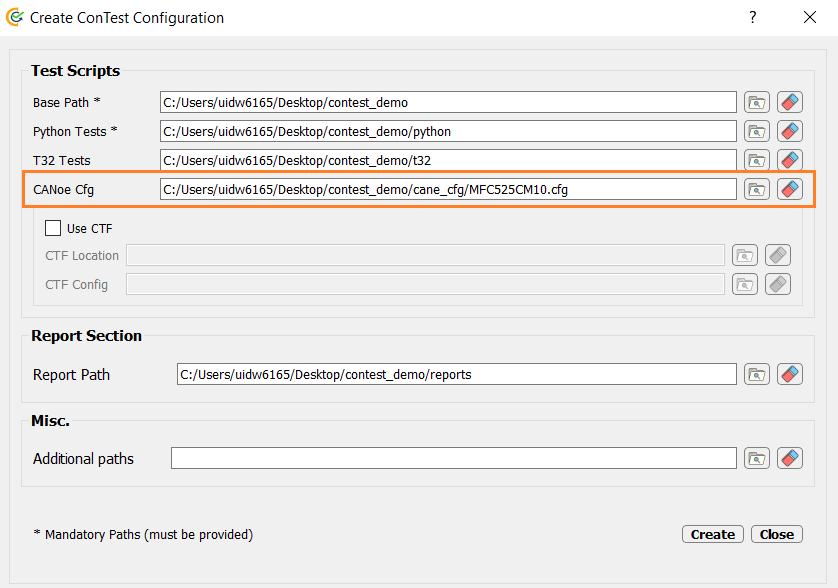

Running CANoe Test Modules (via ConTest GUI)
============================================

.. raw:: html

  <iframe src="https://continental.sharepoint.com/teams/team_10058759/_layouts/15/embed.aspx?UniqueId=a3e6a3d8-9d3c-453f-80b1-71a0a7ca41ff&embed=%7B%22ust%22%3Atrue%2C%22hv%22%3A%22CopyEmbedCode%22%7D&referrer=StreamWebApp&referrerScenario=EmbedDialog.Create" width="640" height="360" frameborder="0" scrolling="no" allowfullscreen title="Run CANoe Test Module (via ConTest GUI).mp4"></iframe>

*Unfortunately the video via Microsoft Sharepoint is only accessible for internals which are members of* `TEPM TPT Trainng Group`_ |br|
*If you're not already a member of* `TEPM TPT Trainng Group`_, *you can request access.*

Apart from using CANoe automated APIs `CANoe APIs`_ in Python test cases, users can make use of a feature
which allows them to execute test modules in a CANoe configuration (.cfg) directly from ConTest. |br|

.. note::
    Please note that there is **NO DUPLICATION** of **Test Modules Names** in CANoe configuration. Duplication of test
    module names is not allowed. User will be prompted with error in such case.

.. note::
    In-case user linked same test script to different test modules then the module in which test script is linked first
    will be executed.

In order to make use of this feature following points are important:

Adding CANoe Path
******************

The path where CANoe configuration (.cfg) is placed can be added in ConTest configuration file (.ini). The
path shall be inside **Base Location** else an error shall be raised. |br|

An example is shown below:

Test Modules Selection
**********************

After loading ConTest configuration (.ini) the user shall be able to search, select or filter CANoe test modules
existing in CANoe configuration (.cfg) mentioned in ConTest configuration (.ini) on ConTest GUI conveniently as shown
below.

.. image:: canoe_tests_view.png
    :width: 600px

CANoe Connection
****************

The connection to CANoe shall be done using Python APIs provided at `CANoe APIs`_ in
``global_setup`` function in ``setup.pytest``. |br|

Example code snippet for making connection in ``setup.pytest`` file is as below:

.. code-block:: python
    :linenos:
    :emphasize-lines: 7, 11, 13, 15-16, 21, 23

    from ptf.ptf_utils.global_params import *
    from contest_canoe.canoe import Canoe

    def global_setup():
        """Function to be executed before all tests"""
        # creating an instance of contest canoe class
        canoe_app = Canoe()
        # saving the instance of canoe class or object in a contest specific variable "canoe"
        # it's important to name your canoe class object variable as "canoe" as the same name is
        # expected by contest test runner
        set_global_parameter("canoe", canoe_app)
        # fetch the canoe configuration path from the contest configuration ini file
        canoe_cfg_path = get_cfg_paths(cfg_path_name="canoeCfg")
        # open canoe cfg and then start simulation
        canoe_app.open_cfg(canoe_cfg_path)
        canoe_app.start_simulation()

    def global_teardown():
        """Function to be executed after all tests"""
        # getting canoe class object
        canoe_app = get_parameter("canoe")
        # closing connection
        canoe_app.close()

    def setup():
        """Function to be executed before each test"""
        pass

    def teardown():
        """Function to be executed after each test"""
        pass

.. _CANoe APIs: ../tool_api_auto.html#canoe
.. _TEPM TPT Trainng Group: https://teams.microsoft.com/l/channel/19%3aeBNePnEjFncYti61Q76hivQ5g-AHsQ6mSO5RmXP8-UE1%40thread.tacv2/General?groupId=5a025357-6a97-45a1-8d61-def802a4a3ed&tenantId=8d4b558f-7b2e-40ba-ad1f-e04d79e6265a

.. |br| raw:: html

     
