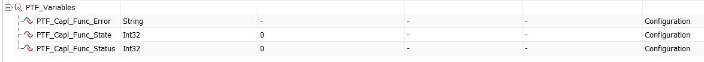

Running CAPL Functions
======================

You can run CAPL functions in ConTest (Python) test cases using a CANoe API `Call CAPL Function`_. |br|
For using this feature you have to follow some guidelines.

    - A CAPL script starting with ``ptf__`` shall be linked to a node in simulation setup e.g. ``ptf__my_functions.can``
    - The functions needed to be called should start from ``Test__``
    - Some ConTest specific system variables shall be created for controlling purpose as shown below

**Use Case:**
    You can use CAPL functions which are only available in CAPL scripting (i.e. functions which are
    not exposed by CANoe COM interface which is used by ConTest) e.g. external dll functions etc.

The script ``ptf__my_functions.can`` will look like this::

    /*
        This file contains CAPL functions which can be called viA PTF CANoe API.
        In order to make this happen some guidelines need to be followed by testers who will
        write CAPL functions in this file.

        Following is a template which can be followed:
    */

    includes
    {

    }

    // DON'T CHANGE
    variables
    {
      int E_OK = 1;
      int E_NOT_OK = 0;
      int FUNCTION_DONE = 1;
    }

    // DON'T CHANGE
    void Return_Status(int status, char error[])
    {
      write("Error Log = %s", error);
      @PTF_Variables::PTF_Capl_Func_Status = status;
      @PTF_Variables::PTF_Capl_Func_State = FUNCTION_DONE;
    }

    // Your CAPL function to be called via PTF CANoe API call_capl_function
    // e.g. <canoe_obj>.call_capl_function('Test__multiply', [20, 10])
    void Test__multiply(long a, long b)
    {
        int c;
        c =  a * b;

        // making decision and reporting error to PTF
        // NOTE: You SHOULD use 'Return_Status' function to communicate status of
        //       your function to PTF
        if (c==200) {
            Return_Status(E_OK, "No Error");
        } else {
            Return_Status(E_NOT_OK, "c!=200");
        }
    }

    // Your CAPL function to be called via PTF CANoe API call_capl_function
    // e.g. <canoe_obj>.call_capl_function('Test__changeSignal')
    void Test__changeSignal(void)
    {
        $my_signal = 2;

        // making decision and reporting error to PTF
        // NOTE: You SHOULD use 'Return_Status' function to communicate status of
        //       your function to PTF
        if (getSignal(my_signal) == 2) {
            Return_Status(E_OK, "No Error");
        } else {
            Return_Status(E_NOT_OK, "my_signal != 2");
        }
    }

.. _Call CAPL Function: ../api_doc/contest_canoe.canoe.html#contest_canoe.canoe.Canoe.call_capl_function

.. |br| raw:: html

     
