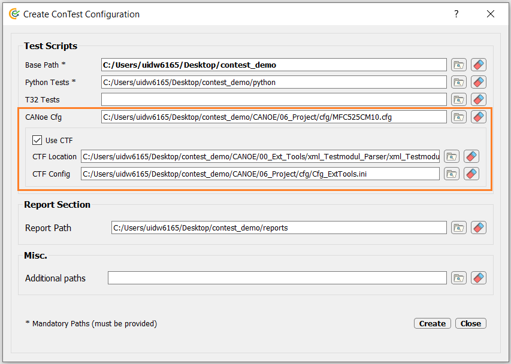
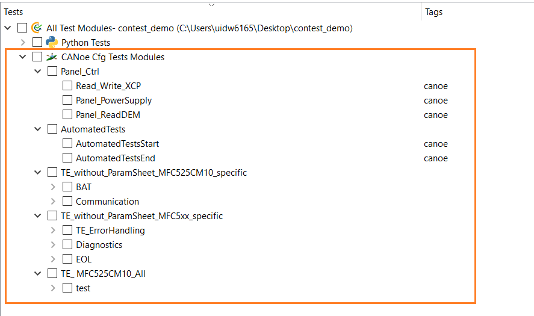

Running CTF
===========

CTF (CANoe Test Framework) provides a foundation for projects to develop test cases in CANoe and pursues three main goals:

- To increase efficiency
- To improve test quality and traceability
- To improve test specification

`CTF Guidelines`_

.. note::
    Please note that there is **NO DUPLICATION** of **Test Modules Names** in CANoe configuration. Duplication of test
    module names is not allowed. User will be prompted with error in such case.

.. note::
    In-case user linked same test script to different test modules then the module in which test script is linked first
    will be executed.

Adding Paths
************

In order to use CTF following paths need to be added in ConTest configuration (.ini)

- CANoe Configuration (.cfg)
- Check CTF Checkbox

    - CTF Tool Zip Path e.g. ``xml_Testmodul_Parser.zip`` or ``TestModuleGenerator.zip``
    - CTF Cfg e.g. ``Cfg_ExtTools.ini``

An example is shown below:

.. note::
    Please note that the CANoe configuration mentioned in ConTest configuration shall be same as mentioned in CTF
    Configuration file i.e. ``Cfg_ExtTools.ini``

Test Modules Selection
**********************

After loading ConTest configuration (.ini) the user shall be able to search, select or filter CANoe test modules
existing in CANoe configuration (.cfg) mentioned in ConTest configuration (.ini) on ConTest GUI conveniently as shown
below.

CANoe Connection
****************

The connection to CANoe shall be done using Python APIs provided at `CANoe APIs`_ in
``global_setup`` function in ``setup.pytest``. |br|

Example code snippet for making connection in ``setup.pytest`` file is as below:

.. code-block:: python
    :linenos:
    :emphasize-lines: 7, 11, 13, 15-16, 21, 23

    from ptf.ptf_utils.global_params import *
    from contest_canoe.canoe import Canoe

    def global_setup():
        """Function to be executed before all tests"""
        # creating an instance of contest canoe class
        canoe_app = Canoe()
        # saving the instance of canoe class or object in a contest specific variable "canoe"
        # it's important to name your canoe class object variable as "canoe" as the same name is
        # expected by contest test runner
        set_global_parameter("canoe", canoe_app)
        # fetch the canoe configuration path from the contest configuration ini file
        canoe_cfg_path = get_cfg_paths(cfg_path_name="canoeCfg")
        # open canoe cfg and then start simulation
        canoe_app.open_cfg(canoe_cfg_path)
        canoe_app.start_simulation()

    def global_teardown():
        """Function to be executed after all tests"""
        # getting canoe class object
        canoe_app = get_parameter("canoe")
        # closing connection
        canoe_app.close()

    def setup():
        """Function to be executed before each test"""
        pass

    def teardown():
        """Function to be executed after each test"""
        pass

.. _CTF Guidelines: https://confluence-adas.zone2.agileci.conti.de/x/rkcaFg
.. _CANoe APIs: ../tool_api_auto.html#canoe

.. |br| raw:: html

     
