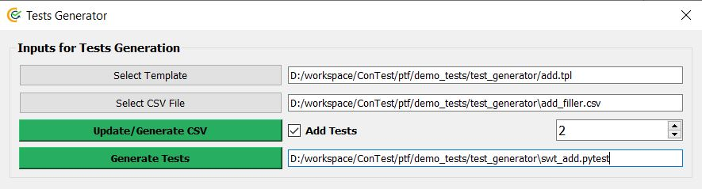
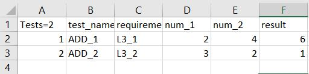

Generate Tests
==============

ConTest provides an option to generate test cases based on a template. |br|
User can create a template of Python test with some markers e.g. ``${marker_name}``. |br|
The value of these markers can be filled with a help of csv file generated by ConTest. |br|
The number of tests cases can be mentioned. |br|
The tests will be generated in a ``.pytest`` file by extracting marker values from csv file. |br|

This option is useful when user needs to develop a large amount of test cases in less time.

Template for a simple addition test:

.. code:: text

    def SWT_${test_name}v1():
        DETAILS("${test_name} verification")

        VERIFIES("${requirement}")

        TESTTAG("hil")

        TESTCASE()

        TESTSTEP("Test for adding numbers ${num_1} and ${num_2}")
        EXPECTED("Result shall be ${result}")
        contest_asserts.verify(${num_1} + ${num_2}, ${result}, "${num_1} + ${num_2} != ${result}")

This template contains 5 markers (test_name, requirement, num_1, num_2, result). |br|
Template can be saved with **.tpl** custom extension.
The template can be given as input using **Generate Tests** option in ConTest **ctrl+g** or from
**Menu->Generate Tests**.

Above screenshot takes addition template and marker values can be filled in **add_filler.csv** file.

After marker values have been filled the tests will be generated in **swt_add.pytest** script. Which
will look as follow:

.. code:: python

    def SWT_ADD_1v1():
         DETAILS("ADD_1 verification")

         VERIFIES("L3_1")

         TESTTAG("hil")

         TESTCASE()

         TESTSTEP("Test for adding numbers 2 and 4")
         EXPECTED("Result shall be 6")
         contest_asserts.verify(2 + 4, 6, "2 + 4 != 6")

    def SWT_ADD_2v1():
         DETAILS("ADD_2 verification")

         VERIFIES("L3_2")

         TESTTAG("hil")

         TESTCASE()

         TESTSTEP("Test for adding numbers 3 and 2")
         EXPECTED("Result shall be 1")
         contest_asserts.verify(3 + 2, 1, "3 + 2 != 1")

.. |br| raw:: html

     
