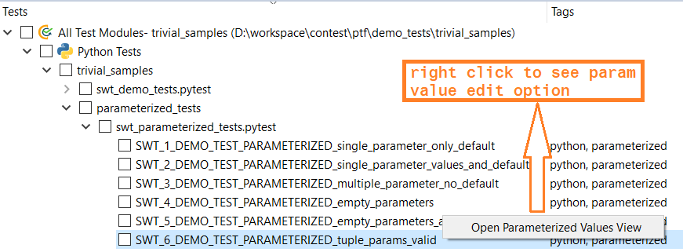

Parameterized Tests
===================

It is possible to run the same testcase repeatedly with different input parameters.
This is for example helpful if you want to ensure that your algorithm/testcase works correctly using different values.
To do so, we have the ``parameterized`` decorator that will run your testcases with each of the given parameters.

Parameterized Decorator
***********************

You can use it like this (parameters need to be in ``list`` form):

.. code-block:: python
    :emphasize-lines: 4-9

    # to be done in custom import section on top of script
    from ptf.ptf_utils.parameterized import parameterized

    @parameterized([
        (1, 1, 2),
        (1, 2, 3),
        (2, 2, 4)
    ])
    def SWT_DEMO_TEST_PARAMETERIZEDv1(n1, n2, sum):
        DETAILS("Demo test to show parameterized tests in ConTest")
        PRECONDITION("Fill in testcase Precondition")

        TESTTAG("requirement")

        TESTSTEP("Check addition")
        EXPECTED("Check Passed")

        contest_asserts.verify(n1 + n2, sum, "Unexpected sum")

This testcase will run three times with different parameters.

- First run if 1 + 1 equals 2.
- Second run if 1 + 2 equals 3.
- Third run if 2 + 2 equals 4.

All testcases will be executed, even if one of the tests fail. But if any of the tests fail, the whole
parameterized test will fail. |br|

Failure Flag
************

To stop execution after the first failed test, you can use the ``stop_on_first_failure`` flag like this:

.. code-block:: python
    :emphasize-lines: 8

    # to be done in custom import section on top of script
    from ptf.ptf_utils.parameterized import parameterized

    @parameterized([
        (1, 1, 2),
        (1, 2, 3),
        (2, 2, 4)
    ], stop_on_first_failure=True)
    def SWT_DEMO_TEST_PARAMETERIZEDv1(n1, n2, sum):

Naming Parameters Sets
**********************

Using ``params_names`` keyword argument in ``parameterized`` decorator, users can name parameter sets conveniently.

.. code-block:: python
    :emphasize-lines: 10

    # to be done in custom import section on top of script
    from ptf.ptf_utils.parameterized import parameterized

    @parameterized(
        params=[
            (1, 1, 2),
            (1, 2, 3),
            (2, 2, 4)
        ],
        params_names=("set_1", "set_2", "set_3")  # or ["set_1", "set_2", "set_3"]
    )
    def SWT_DEMO_TEST_PARAMETERIZEDv1(n1, n2, sum):

In-case of above example the names of the parameterized tests shall be as below (in reports):

- **SWT_DEMO_TEST_PARAMETERIZEDv1(index: set_1)**
- **SWT_DEMO_TEST_PARAMETERIZEDv1(index: set_2)**
- **SWT_DEMO_TEST_PARAMETERIZEDv1(index: set_3)**

.. note::

    - If elements in ``params`` > elements in ``param_names``
        The index number shall be used for missing elements in ``param_names``

    - If elements in ``params`` < elements in ``param_names``
        The extra elements given in ``param_names`` shall be ignored

Values Via Generator Function
*****************************

You can also use a generator function to produce the parameter sets:

.. code-block:: python
    :emphasize-lines: 14

    # to be done in custom import section on top of script
    from ptf.ptf_utils.parameterized import parameterized

    def parameter_generator():
        """
        generates a sequence of tuples of all
        combinations of `a` 0..4 and `b` 0..9
        and the sum of `a` and `b`
        """
        for a in range(5):
            for b in range(10):
                yield (a, b, a + b)

    @parameterized(parameter_generator(), stop_on_first_failure=True)
    def SWT_DEMO_TEST_PARAMETERIZEDv1(n1, n2, sum):

Demo Tests
**********

`Parameterized Scenario Demo Tests`_

.. note::
    Kindly avoid to parameterize Requirement IDs in ``parameterized`` test cases since the traceability will not work.

Valid Set Types
***************

The parameter arguments values can be given in following types:

String
------

.. code-block:: python

    @parameterized(["value_1", "value_2"])
    def SWT_PARAM_STRv1(arg_1, arg_2)

Tuple
-----

.. code-block:: python

    @parameterized([(1, 2, 3), (4, 5, 6)])
    def SWT_PARAM_TUPLEv1(arg_1, arg_2, arg_3)

List
----

.. code-block:: python

    @parameterized([["abc", "def"], ["ghi", "jhk"]])
    def SWT_PARAM_LISTv1(arg_1, arg_2)

Dictionary
----------

.. code-block:: python

    @parameterized([{"arg_1": 1, "arg_2": 2}, {"arg_1": 3, "arg_2": 4}])
    def SWT_PARAM_DICTv1(arg_1, arg_2)

Function Generator
------------------

.. code-block:: python

    # 'generator_function' function which yields values for 'arg_1' & 'arg_2'
    @parameterized(generator_function())
    def SWT_PARAM_GENv1(arg_1, arg_2)

Edit Values Via GUI
*******************

The values of test case function parameters/arguments can be edited via ConTest GUI which makes the parameterized tests
execution cycle faster. |br|

In order to use this feature the user can right click on parameterized test case which will open a window where test
case function parameters/arguments can be edited and applied. |br|

Example Test
------------

The scenario will be explained based on following test case:

.. code-block:: python

    @parameterized([
    ("abc", "foo", 4, 7),
    ("abc", "foo", 2),
    ("abc", "foo", 6, 3, 2, False)])
    def SWT_6_DEMO_TEST_PARAMETERIZED_tuple_params_valid(arg_1, arg_2, arg_3, arg_4=5, arg_5=5, arg_6=True):

Edit Window
-----------

The values of the arguments can be edited in following GUI window. The values can be edited in respective cells. |br|

.. note::
    Users have to make sure to right correct data types for a specific argument used in test case in relevant cells.

.. note::
    Only ``string, int, float and boolean`` types are editable. Others types value changes are not possible currently.

.. image:: param_tests_view.png

1. Test Case Name
2. Add Set
3. Original Value Reset Button
4. Apply Button
5. Param Set Selections
6. User added sets identified as ``*``

Add New Sets via GUI
********************

New sets for an existing parameterized test can be added via **Param Test View Window**. |br|
This option can be explained with the help of a demo test as shown below which is having sets for ``+, *, /`` mathematical operators. |br|

.. code-block:: python
    :emphasize-lines: 1-6

    @parameterized(
        params=[
            (1, "+", 2, 3),
            (2, "*", 2, 4),
            (4, "/", 2, 2)
        ],
        stop_on_first_failure=False, print_full_parameters=True,
        params_names=("add", "mul", "div")
    )
    def SWT_SIMPLE_CALCULATORv1(num_1, operator, num_2, expected_result):
        DETAILS("Generic test case to perform some basic calculations")
        PRECONDITION("Math knowledge")

        VERIFIES("Math")

        TESTTAG("calc")

        TESTSTEP("Evaluate the expression")
        EXPECTED("Evaluated value shall be equal to expected result")
        calculator_expression = f"{num_1} {operator} {num_2}"
        print(f"Calculating: {calculator_expression}")
        actual_result = eval(f"{calculator_expression}")
        contest_asserts.verify(actual_result, expected_result, f"Error in calculation\n\t"
            f"{calculator_expression} != {expected_result}")
        print(f"{calculator_expression} = {expected_result}")

Now if we want to add another mathematical operator ``-``, we can easily add it using help of **Add Set** button as shown below. |br|

.. image:: add_param_sets.png

The newly added sets will be marked as ``*`` which indicates it's added by user.

Invalidity Scenarios
********************

A parameterized set shall be considered as **INVALID** if user added a new set or modified the value of an existing set.

In-case of **INVALID** scenario, following points shall be kept in mind:

- Newly added and modified sets are by definition ``INVALID`` as they contain or include information which differs from test scripts which are treated as true source of information.
- Newly added sets will be named with suffix ``__USER_ADDED_INVALID`` to clearly report them **INVALID** to user.
- Edited sets will be named with suffix ``__USER_MODIFIED_INVALID`` to clearly report them **INVALID** to user.
- Newly added and modified sets will NOT be added in **CatHat XML Report** as a preventive measure to not sync unreviewed test data set into ETM and also it will introduce duplication of artifacts (tests) in ETM if manual report synchronization shall be done.
- **HTML Reports (summary and individual test report)** for newly added and modified sets will contain ``DISCLAIMER`` to report test invalidity.

.. _Parameterized Scenario Demo Tests: https://github-am.geo.conti.de/ADAS/ConTest/tree/master/ptf/demo_tests/trivial_samples/parameterized_tests

.. |br| raw:: html

     
