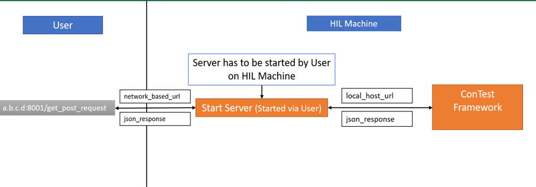

REST Service
============

RESTful application interface helps to control an application or tool remotely over network with server and client
functionality. ConTest provides REST service with the help of independent server and client implementation. |br|

The REST server is independent from ConTest framework which helps to send HTTP requests and receive response
independently from the framework which makes it easy to support GET and POST HTTP requests. |br|

Concept
*******

Starting REST Server
********************

ConTest REST server can be started listening to a particular port for client connection can be started as follow:

.. code-block:: powershell

    cd <contest_release_folder>
    python rest_service\contest_server.py --port 5002

Starting REST Client
********************

ConTest REST client can be started in order to make connection with running server over a port is as follow:

.. note::
    The port number given to start the client shall be same as given in start of the server.

.. code-block:: powershell

    cd <contest_release_folder>
    python main.py --rest-port 5002

GET Requests
************

Following table contains the URLs which can be requested once server and client connection is established.

``<ip_or_localhost>:`` IP of remote machine on which server is running |br|
``port:`` Port number over which server and client connection is established

.. note::
    The responses of all these requests will be in JSON format.

+------------------------------------------------------------------------------+------------------------------------------------------------------------+
|                               HTTP URLs                                      |                             Description                                |
+==============================================================================+========================================================================+
| ``http://<ip_or_localhost>:<port>/api/version``                              |  Get ConTest REST Server Version                                       |
+------------------------------------------------------------------------------+------------------------------------------------------------------------+
| ``http://<ip_or_localhost>:<port>/api/v1/contest/version``                   |  Get ConTest Version                                                   |
+------------------------------------------------------------------------------+------------------------------------------------------------------------+
| ``http://<ip_or_localhost>:<port>/api/v1/contest/status``                    |  Get ConTest current status e.g. ``idle``, ``running``                 |
+------------------------------------------------------------------------------+------------------------------------------------------------------------+
| ``http://<ip_or_localhost>:<port>/api/v1/contest/config_info``               |  Get loading cfg information                                           |
+------------------------------------------------------------------------------+------------------------------------------------------------------------+
| ``http://<ip_or_localhost>:<port>/api/v1/contest/loaded_config``             |  Get name of loaded configuration                                      |
+------------------------------------------------------------------------------+------------------------------------------------------------------------+
| ``http://<ip_or_localhost>:<port>/api/v1/contest/report_folder``             |  Get path of report folder                                             |
+------------------------------------------------------------------------------+------------------------------------------------------------------------+
| ``http://<ip_or_localhost>:<port>/api/v1/contest/report_txt``                |  Get TXT summary report path                                           |
+------------------------------------------------------------------------------+------------------------------------------------------------------------+
| ``http://<ip_or_localhost>:<port>/api/v1/contest/report_xml``                |  Get XML report path                                                   |
+------------------------------------------------------------------------------+------------------------------------------------------------------------+
| ``http://<ip_or_localhost>:<port>/api/v1/contest/report_json``               |  Get JSON summary report path                                          |
+------------------------------------------------------------------------------+------------------------------------------------------------------------+
| ``http://<ip_or_localhost>:<port>/api/v1/contest/report_html``               |  Get HTML summary report path                                          |
+------------------------------------------------------------------------------+------------------------------------------------------------------------+
| ``http://<ip_or_localhost>:<port>/api/v1/contest/test_info/SWT_TEST_FAILv1`` |  Get a particular test information                                     |
+------------------------------------------------------------------------------+------------------------------------------------------------------------+
| ``http://<ip_or_localhost>:<port>/api/v1/contest/setup_file``                |  Get currently used ``setup.pytest`` file                              |
+------------------------------------------------------------------------------+------------------------------------------------------------------------+

POST Requests
*************

Coming soon ...

.. |br| raw:: html

     
