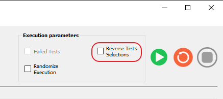
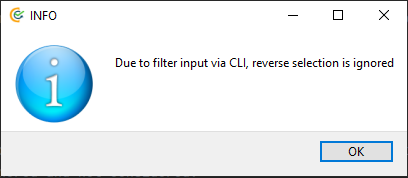

Reverse Test Selection
======================

It is possible to reverse the test selection and execute the unselected tests. i.e. User selected tests will be
deselected and unselected tests will be selected and executed.

This is possible in CLI mode, CLI mode with GUI and in GUI mode. In CLI mode this is possible with the argument
``--reverse_selection``. In GUI mode this is possible with the provided check box, as shown in the image below.

Reverse test selection in GUI
*****************************

Reverse test selection in CLI mode
**********************************

.. code-block:: powershell

    cd <contest_repository_path>
    <python_exe_absolute_path> main.py -r auto -c <path_to_your_configuration_file> --reverse_selection

Reverse test selection in CLI mode with auto_gui
************************************************

.. code-block:: powershell

    cd <contest_repository_path>
    <python_exe_absolute_path> main.py -r auto_gui -c <path_to_your_configuration_file> --reverse_selection

Reverse test selection along with filter input
**********************************************

If the ``--reverse_selection`` argument is used along with ``--filter`` argument, filter tag(s) will be taken into
high priority and reverse selection will be ignored and not considered.

