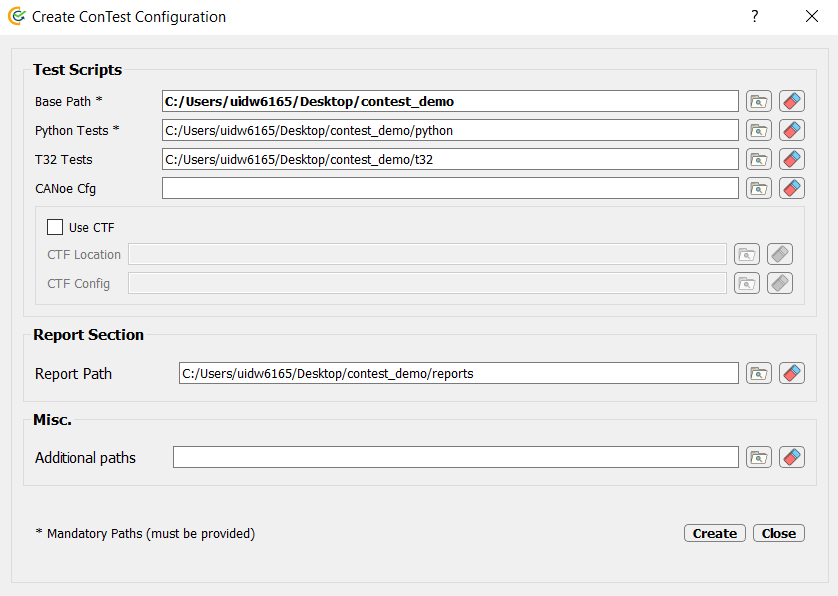
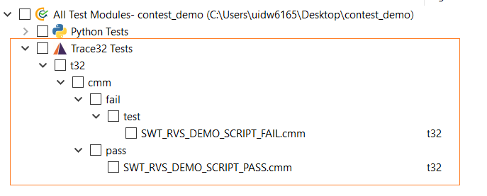

.. This file explains use-case of running lauterbach scripts

Running Lauterbach Scripts
==========================

Apart from using lauterbach automated APIs `Lauterbach APIs`_ in Python test cases, users can make use of a feature
which allows them to execute Lauterbach PRACTICE scripts directly from ConTest. |br|

With this feature each Lauterbach PRACTICE script shall be treated as a separate test case. |br|

.. note::
    This feature shall be useful when some Lauterbach functionality is not provided in `Lauterbach APIs`_.

In order to make use of this feature following points are important:

Adding CMM Scripts Path
***********************

The path where Lauterbach PRACTICE scripts (.cmm) are placed can be added in ConTest configuration file (.ini). The
path shall be inside **Base Location** else an error shall be raised. |br|
An example is shown below:

CMM Scripts Naming
******************

The Lauterbach PRACTICE scripts (.cmm) shall be named with prefix ``SWT_`` which helps the framework to filter
Lauterbach scripts which need to be treated as test cases e.g. **SWT_<meaningful_name>.cmm** |br|
The test scripts shall be shown on GUI as below for execution and selection purpose.

Lauterbach Connection
*********************

The connection to Lauterbach debugger shall be done using Python APIs provided at `Lauterbach APIs`_ in
``global_setup`` function in ``setup.pytest``. |br|

Example code snippet for making connection in ``setup.pytest`` file is as below:

.. code-block:: python
    :linenos:
    :emphasize-lines: 9, 10, 11, 13, 18, 20

    from ptf.ptf_utils.global_params import *
    from contest_lauterbach.lauterbach import Lauterbach

    def global_setup():
        """Function to be executed before all tests"""
        # creating lauterbach instance for 't32marm' core
        # connecting to 't32marm.exe' core with settings in 'config_marm.t32'
        t32_marm = Lauterbach(
            t32_app=r"C:\T32\bin\windows64\t32marm.exe",
            t32_cfg=r"C:\T32\config_marm.t32")
        # assigning it to a global variable 't32_marm'
        set_global_parameter("t32_marm", t32_marm)

    def global_teardown():
        """Function to be executed after all tests"""
        # getting 't32_marm' variable created in 'global_setup'
        t32_marm = get_parameter("t32_marm")
        # closing lauterbach connection
        t32_marm.close()

    def setup():
        """Function to be executed before each test"""
        pass

    def teardown():
        """Function to be executed after each test"""
        pass

CMM Script Template
********************

In order to let framework monitor the execution of scripts as well as reporting of such script some guidelines or
format need to be followed while writing such tests. |br|
These guidelines help ConTest to generate reports similar to ``.pytest`` files as well as error handling. |br|

- Example *cmm* script as ConTest test case::

    (
        LOCAL &result

        // for grabbing input parameters provided via ConTest T32 test runner
        ENTRY &t32UtilPath &reportPath &scriptName

        GLOBALON CMD REPORT inherit
        GLOBALON CMD REPORT DO &t32UtilPath

        PMACRO.EXPLICIT

        // Setup the standard error handler
        GLOBALON ERROR GOSUB
        (
            // Once an error occurred disable error handler to prevent dead-locks
            ON ERROR default
            REPORT TestCaseExitOnDebuggerError ""
        )

        REPORT TestSetup "This is a dummy test case" &reportPath &scriptName

        // goto sub-routine and execute test case
        GOSUB TestCase

        // close report file after this report will be copied to report location
        REPORT TestCaseFinalExit &scriptName
        ENTRY &result

        // print test result on message area so Python framework can read it to
        // verify test PASS/FAIL
        PRINT "&result"

        // exit from the test script
        ENDDO
    )

    // NOTE: Real test case starts from here the above statements are just for making arrangements
    //       for this script to be able to run via ConTest T32 test runner
    TestCase:
    (
        REPORT Detail "You can write here the details of your test case"
        REPORT Detail "You can write here the details of your test case"

        REPORT Precondition "Fill in testcase precondition"

        REPORT Verifies "Mention requirement ID being verified by this test case"
        REPORT Verifies "Mention requirement ID being verified by this test case"

        REPORT Tag  "Mention test-tag i.e. hil, design-driven, blackbox, integration"

        // here you can do normal T32 PRACTICE scripting
        PRINT "In TestCase ..."

        REPORT TestStep "Mention here the step you want to perform and verify"

        // as an example following we are checking a variable (my_variable) to be equal to 1
        PRIVATE &actualValue
        PRIVATE &expectedValue
        &expectedValue=1

        REPORT TestStep "Checking the variable my_variable value to be equal to &expectedValue"
        Var.IF (my_variable!=&expectedValue)
        (
            // error reporting loop
            // grabbing actual value of my_variable for reporting error
            &actualValue=VAR.VALUE(my_variable)
            PRINT "my_variable = &actualValue"
            // reporting error
            REPORT TestStepFail "my_variable != &expectedValue"
            // returning from script since error occurred
            RETURN
        )

        // write this at the end of your test case
        // this will tell ConTest T32 Test runner that all steps above it are passed
        REPORT TestStepPass

        // do not miss this return statement
        RETURN
    )

.. note::
    The reporting idea for above ``cmm`` scripts is inspired from ADAS Test Automation Framework (TAF)
    and changed according to ConTest needs.

.. _Lauterbach APIs: ../tool_api_auto.html#lauterbach

.. |br| raw:: html

     
