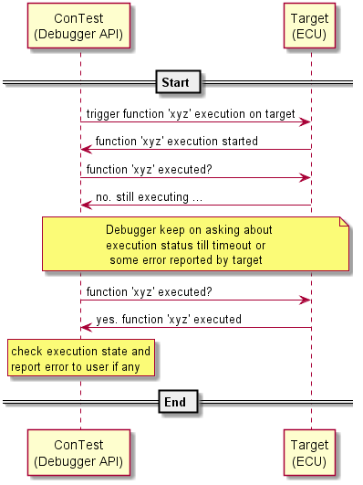

Real Time Target Func Run
=========================

You can run a C function on target in real time in ConTest using T32 debugger API **run_func_on_target**. |br|
For this a small piece of code can be added in project software in order to make some external
device (debugger) to access the target device. |br|

For target having an AUTOSAR OS, a low priority task can be added in code. This task can be marked as low priority
in it's settings. |br|

.. note::

    You can simulate some fake conditions by making API calls.
        - trigger some SW mode
        - read/write some peripherals (ISPs, Deserializers etc.) register values during run-time
        - call SW functions and monitor registers etc.

Following is a brief example of how it can be done step-wise:

Create Autosar OS Task
**********************

Create a low priority AUTOSAR OS (it depends on target's OS how to add this) e.g. 'Testing_Task'

Target Side Implementation
**************************

Controlling Code
----------------

Create file to initialize some controlling variables (for helping ConTest keeping track of function execution on target)
and registering test functions for calls via ConTest API. Following is an example of such file:

.. code-block:: c

    /**
     * @copyright    2020 ADC Automotive Distance Control Systems GmbH / Continental Corporation
     * @author       <your_name>
     * @brief        Function calling implementation.
     */

    /* here you can do some includes depending on your project and os */

    /* including header file containing testing functions to be called via ConTest API
       this will be explained in next step(s) */
    #include "common_tests.h"

    /* MACRO for default or invalid value of test function index */
    #define INVALID_VALUE 255

    /* testing functions pointer array
     *
     * It can be populated with any new testing function  declared in 'common_test.h' file and
       implemented in 'common_test.c' file */
    caller testCaller[] = {
            &Test_Dummy_1,
            &Test_Dummy_2
    };

    /* initializing 'Func_State' to 'FUNC_IDLE'
     * this variable will help test framework to detect the requested test function's
     * execution status */
    static volatile Common_Func_State funcState = FUNC_IDLE;
    /* this variable will be controlled by testing framework and it's value will
     * determine which testing function to run */
    static volatile funcIndex testFuncIndex = INVALID_VALUE;

    /*
     * **********************************************************************************
     * Task for integration testing (as mentioned in step 1 'Testing_Task' was created)
     * **********************************************************************************
     */
    TASK(Testing_Task)
    {
        do
        {
            /* 'testFuncIndex' will be changed from ConTest API */
            if (INVALID_VALUE != testFuncIndex) {
                /* for telling ConTest that the requested testing function's
                 * execution has started
                 *
                 * the 'Func_State' will be read by ConTest */
                 funcState = FUNC_START;
                 /* calling function requested via ConTest API */
                 testCaller[testFuncIndex]();
                 /* for telling ConTest that the requested testing function's execution has ended
                  *
                  * the 'Func_State' will be read by test framework */
                 funcState = FUNC_END;
                 /* changed 'testFuncIndex' back to default value in order to
                  * avoid running test function again */
                 testFuncIndex = INVALID_VALUE;
            } else {
                 /* it's noted that if nothing is done in else condition then
                  * background task does not run properly therefore to avoid that
                  * scenario a small delay is added */
                Delay_us(10);
            }
        } while (1);
        (void)TerminateTask();
    }

Target Functions
----------------

Now create files for functions to be called e.g. common_tests.h, common_tests.c

Example for ``common_tests.h``

.. code:: c

    /**
     * @copyright    2020 ADC Automotive Distance Control Systems GmbH / Continental Corporation
     * @author       <your_name>
     * @brief        Declarations of function(s) and variable(s) required by ConTest.
     */

    #include <stdint.h>
    #include <Std_Types.h>

    /**
     * State for monitoring common test function's state from ConTest API
     */
    typedef enum  {
        FUNC_IDLE,
        FUNC_START,
        FUNC_END
    } Common_Func_State;

    /* type for function pointer array */
    typedef void (*caller)(void);

    /**
     * Structure for common input/output variables.
     *
     * These variables will be written/read by ConTest API.
     * The testers are free to introduce new variables if required but it's
     * recommended to use existing variables.
     */
    struct Common_Test_Variables {
        /* uint8's */
        uint8_t uint8Test1;
        uint8_t uint8Test2;
        uint8_t uint8Test3;
        /* for storing the function's error reasoning */
        char functionErrorLog[50];
    };

    typedef uint8_t funcIndex;

    /* dummy functions which will be called by ConTest API */
    void Test_Dummy_1(void);
    void Test_Dummy_2(void);

Example for ``common_tests.c``

.. code:: c

    /**
     * @copyright    2020 ADC Automotive Distance Control Systems GmbH / Continental Corporation
     * @author       <your_name>
     * @brief        Implementation of function(s) to be called by ConTest.
     */

    #include "common_tests.h"

    /* structure for common input/output variables */
    struct Common_Test_Variables commonVariables;

    /* common testing function's return boolean variable.
     * for reporting the function's state to ConTest */
    static boolean isFuncOk = TRUE;

    /*
     * Function to be called via ConTest API
     *
     * It checks a variable to be equal to value 2
     */
    void Test_Dummy_1(void)
    {
        /* commonVariables.uint8Test1 value can be changed by ConTest 'write_variable' API' */
        /* checking if variable is 2 or not */
        if (commonVariables.uint8Test1 == 2) {
            /* updating monitoring variable to TRUE to let ConTest know that function executed
               successfully */
            isFuncOk = TRUE;
        } else {
            /* updating error log variable to which will be read by ConTest for reporting error */
            strcpy(commonVariables.functionErrorLog, "commonVariables.uint8Test1 != 2");
            /* updating monitoring variable to FALSE to let ConTest know that function executed
               without success */
            isFuncOk = FALSE;
        }
        /* NOTE: it's important to update 'isFuncOk' variable with TRUE/FALSE to let ConTest know
           about function's execution state */
    }

    /*
     * Function to be called via ConTest API
     *
     * It checks a variable to be equal to value 10
     */
    void Test_Dummy_2(void)
    {
        /* commonVariables.uint8Test2 value can be changed by ConTest 'write_variable' API' */
        /* checking if variable is 10 or not */
        if (commonVariables.uint8Test2 == 10) {
            /* updating monitoring variable to TRUE to let ConTest know that function executed
               successfully */
            isFuncOk = TRUE;
        } else {
            /* updating error log variable to which will be read by ConTest for reporting error */
            strcpy(commonVariables.functionErrorLog, "commonVariables.uint8Test2 != 10");
            /* updating monitoring variable to FALSE to let ConTest know that function executed
               without success */
            isFuncOk = FALSE;
        }
        /* NOTE: it's important to update 'isFuncOk' variable with TRUE/FALSE to let ConTest know
           about function's execution state */
    }

Test Side Implementation
************************

Now just call these functions via `run_func_on_target`_ as follow:

.. code:: python

    # calling or executing 'Test_Dummy_1' on target in real time
    debug.run_func_on_target('Test_Dummy_1')
    # calling or executing 'Test_Dummy_2' on target in real time
    debug.run_func_on_target('Test_Dummy_2')

Flow Control
************

The above scenario is implemented as follow:

.. _run_func_on_target: ../api_doc/contest_lauterbach.lauterbach.html#contest_lauterbach.lauterbach.Lauterbach.run_func_on_target

.. |br| raw:: html

     
