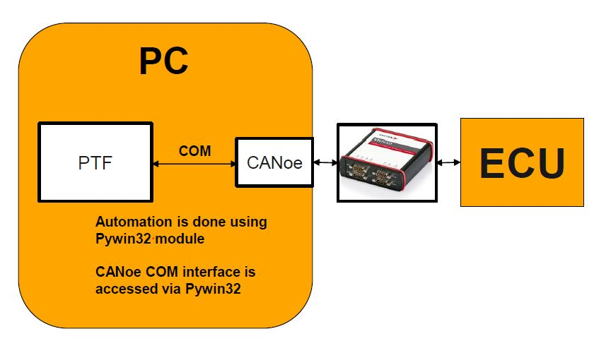

.. This file explains CANoe concept in ConTest

CANoe
=====

CANoe automation is done in following way:

For APIs see canoe_tool_

.. _canoe_tool: ../tool_api_auto.html#canoe

.. |br| raw:: html

     

