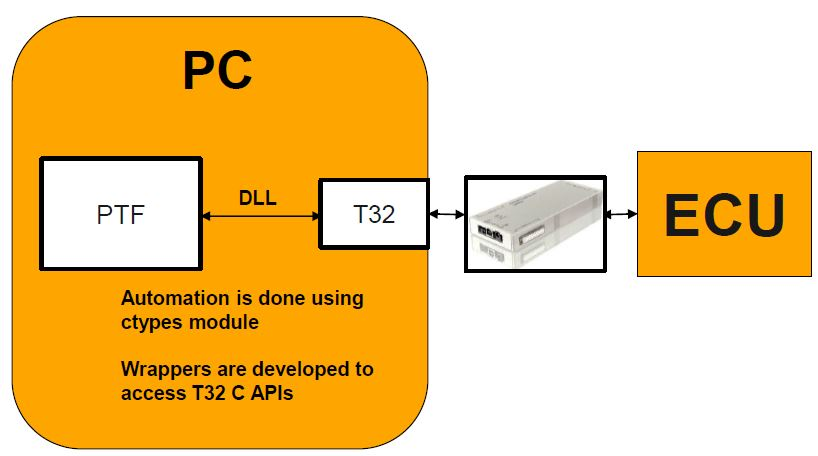

.. This file explains Lauterbach concept in ConTest

Lauterbach
==========

Lauterbach automation is done in following way:

For APIs see t32_tool_

.. _t32_tool: ../tool_api_auto.html#lauterbach

.. |br| raw:: html

     

