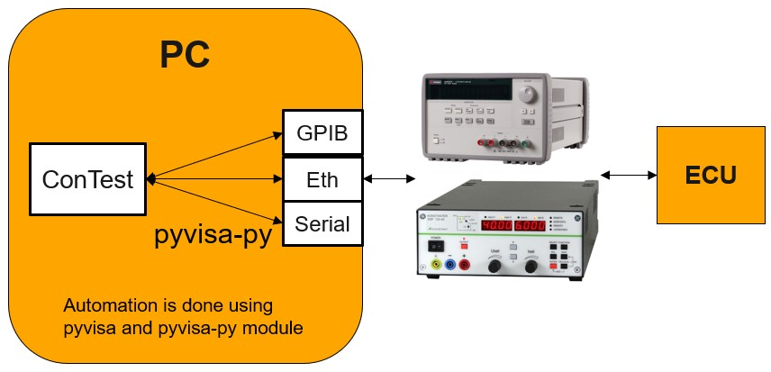

Programmable Power Supply Units (PSUs)
======================================

Contest supports power supplies that implement the "Virtual Instrument Software Architecture" (Visa_).

It uses the pyvisa-py_ library for communication to the devices. This has two advantages:

    - pyvisa-py is platform independent and uses default libraries supported by python
    - It provides a common interface for multiple connection types like serial connection,
      GPIB or ethernet.

A custom command mapping for each device is still needed in 'commands.json', since each device has
different commands to execute the supported feature like setting voltage/current.

The automation is done in the following way:

For APIs see psu_tool_.

.. _Visa: http://www.ivifoundation.org/Downloads/Specifications.htm
.. _pyvisa-py: https://github.com/pyvisa/pyvisa-py
.. _psu_tool: ../tool_api_auto.html#psu
