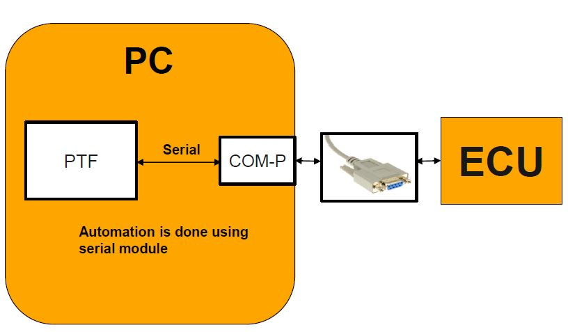

.. This file explains serial communication concept in ConTest

Serial Communication
====================

Serial automation is done in following way:

For APIs see serial_tool_

.. _serial_tool: ../tool_api_auto.html#serialcomm

.. |br| raw:: html

     