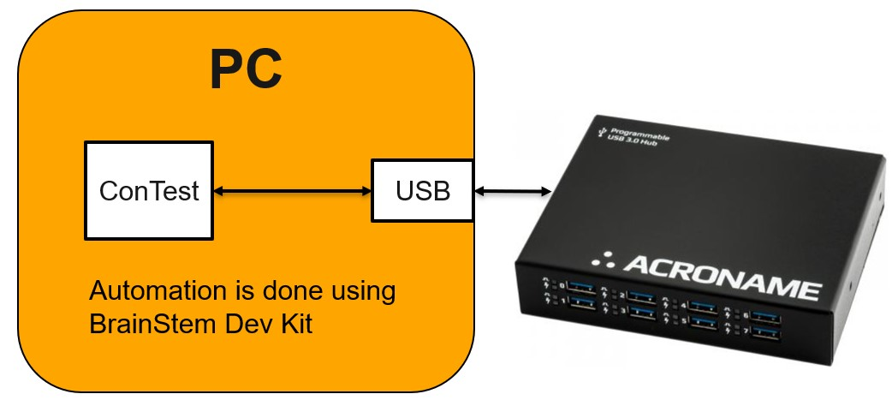

.. This file explains Acroname USBHub 3P tool integration concept in ConTest

Acroname USBHub 3P
==================

The usb hub automation is done in following way:

Requirements
------------

Latest Dev kit can be found: `Brainstem Dev Kit <dev_kit_>`_ .
also available part of ConTest: ConTest/bin/brainstem/ .

APIs
----
For available APIs see usb_hub_api_

.. _dev_kit: https://acroname.com/software/brainstem-development-kit
.. _usb_hub_api: ../tool_api_auto.html#usbhub3p

.. |br| raw:: html

     