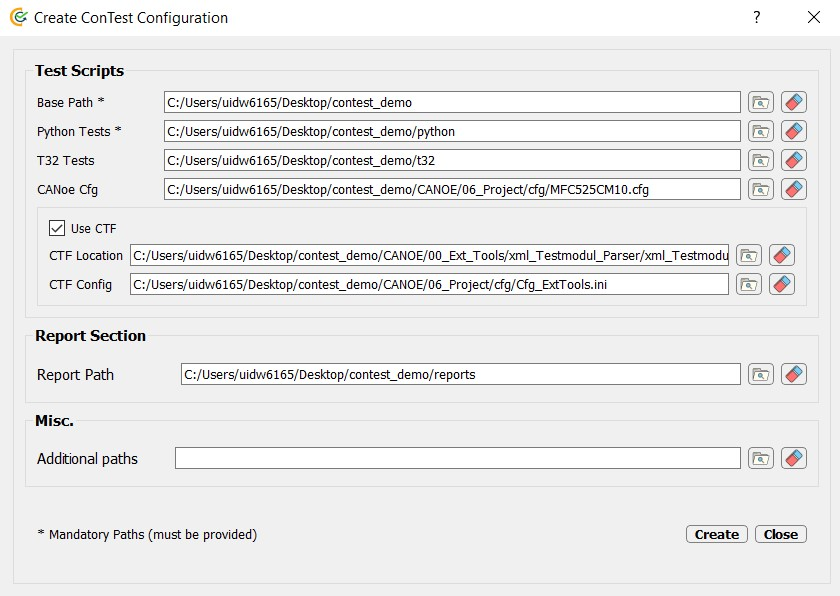
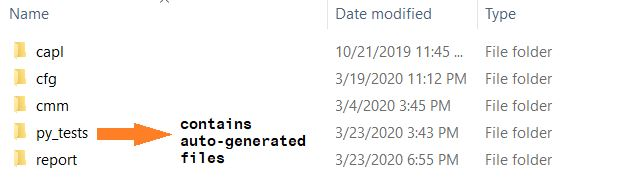
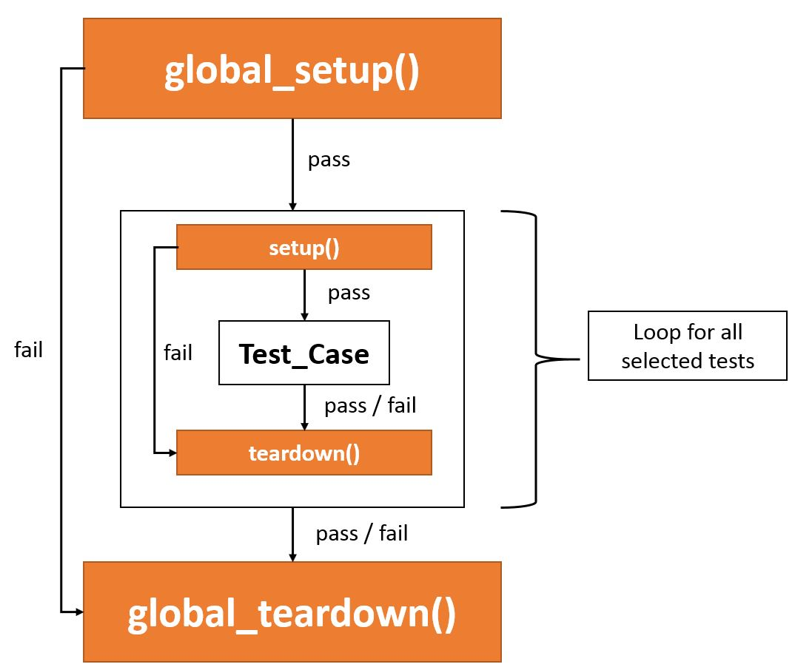
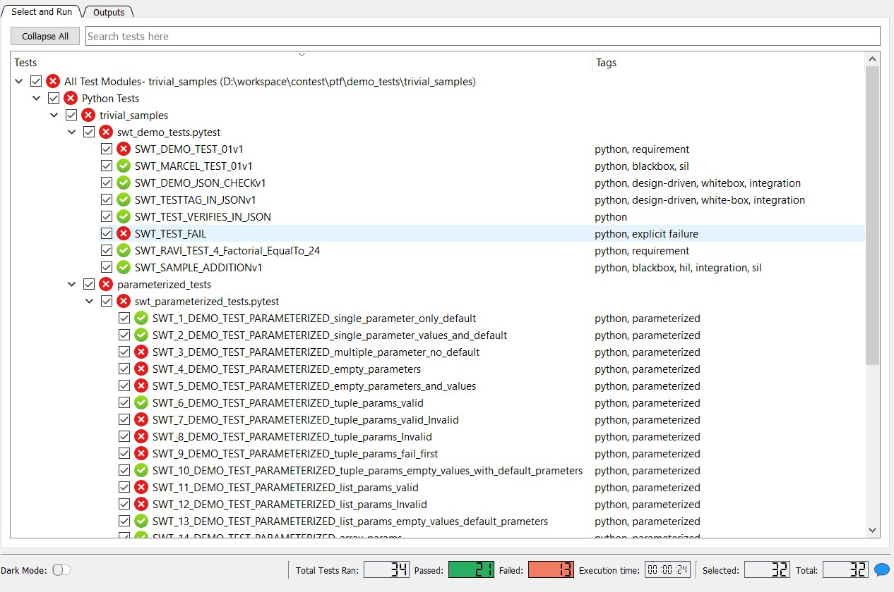

.. This file explains the usage of ConTest

How To Use
==========

This chapter explains how a user can write and execute test cases in ConTest. |br|

Start ConTest by reading How_To_Run_

1. Create Config
****************

As a first step you can create a configuration of your project with customized paths.

.. note::
    Make sure you decide about paths within your team so everyone is aligned i.e. configuration
    file works for all team members. |br|
    Otherwise read How_To_Run_ chapter to use **-l** option.

New configuration can be created by pressing **ctrl+n** or from menu bar **Menu->Create Config**

You can fill the entries in **New Configuration** dialog box. |br|
Video on this topic is available. Checkout `Training section`_. |br|

Example Config Creation
-----------------------

Let's create a new configuration for a dummy project named as **my_project**:

Config Entries Explanation
--------------------------

**Explanation of some important entries:**

+--------------+-----------------------------------------------------------------------+
|    Entry     |                       Explanation                                     |
+==============+=======================================================================+
| Base Path    | Location where you will store your Python test scripts and reports    |
+--------------+-----------------------------------------------------------------------+
| Python Tests | Python test scripts location i.e. your .pytest and .py scripts        |
+--------------+-----------------------------------------------------------------------+
| CMM Tests    | CMM Test scripts location (should be following guidelines)            |
+--------------+-----------------------------------------------------------------------+
| CANoe Cfg    | CANoe Configuration (.cfg) Path                                       |
+--------------+-----------------------------------------------------------------------+
| Use CTF      | Check if you want to use CTF (CANoe Test Framework)                   |
+--------------+-----------------------------------------------------------------------+
| CTF Loc      | Location of CTF Tool Zip File                                         |
+--------------+-----------------------------------------------------------------------+
| CTF Cfg      | Location of CTF Cfg File e.g. ``Cfg_ExtTools.ini``                    |
+--------------+-----------------------------------------------------------------------+
| Report Path  | Path where you want ConTest reports to be generated                   |
+--------------+-----------------------------------------------------------------------+

.. note::
    For CMM Tests please check details at `Running Lauterbach Scripts`_

.. note::
    For CANoe Tests please check details at `Running CANoe Test Modules`_

.. note::
    For CTF+CANoe Scenario please check details at `Running CTF`_

.. note::
    Each entry help can be seen by hovering mouse over it

.. note::
    DO NOT change the configuration file (.ini) file manually in order to avoid any unexpected
    behaviour

After providing paths you can press **Create** button for creating config file and saving it. |br|

Auto-Generated Helper Files
---------------------------

Some helper files will be created in **Python Tests** location. |br|
You can read **README.txt** file for more information.

Based on above example the **Base Location** shall look as follow:

Load Config
-----------

If you already have a configuration file then press **ctrl+l** to load it. |br|
You can also load from menu bar **Menu->Load Config**

2. Create Tests
***************

After configuration has been created for a project user can start writing test cases. |br|
Goto your **Python Tests** location and write test content in **.pytest** files.

.. note::
    **.pytest** is a customized extension for proper documentation of your test cases. |br|
    It's nothing else then a normal **.py** script.

Using setup.pytest
------------------

A **setup.pytest** file will be created with helping comments when new config was created. |br|
This file contains 4 functions:

+-------------------+-----------------------------------------------------------------------+
|  Functions        |                       Explanation                                     |
+===================+=======================================================================+
| global_setup      | Function to be executed **before all** test cases once                |
+-------------------+-----------------------------------------------------------------------+
| setup             | Function to be executed **before each** test case                     |
+-------------------+-----------------------------------------------------------------------+
| teardown          | Function to be executed **after each** test case                      |
+-------------------+-----------------------------------------------------------------------+
| global_teardown   | Function to be executed **after all** test cases once                 |
+-------------------+-----------------------------------------------------------------------+

Video on this topic is available. Checkout `Training section`_. |br|
The variables you created in this file are accessible in test scripts as well as in this script. |br|
More information can be read inside these function **doc-strings**

Example::

    """
    Copyright 20xx Continental Corporation

    This file contains up to four methods that will be called by the test framework:
        - global_setup(): Will be called before ALL test-cases
        - setup(): Will be called before EACH test-case
        - teardown(): Will be called after EACH test-case. Will also be called if test-case fails.
        - global_teardown(): Will be called after ALL test-cases.
                             Will be called if any execution before fails.

    :file: setup.pytest

    :author:
        - <your_name>
    """

    # standard Python import area

    # PTF or custom import area
    # NOTE : ALWAYS IMPORT (contest_expects, contest_asserts and global_params) AS BELOW.
    #        FOR PROPER ERROR REPORTING AND PARAMETER CONTROL
    from contest_verify.verify import contest_asserts
    from contest_verify.verify import contest_expects
    from ptf.ptf_utils.global_params import *

    def global_setup():
        """
        This method will be called before ALL testcases are executed.
        You can set global variables with :func:`set_global_parameter`.
        Will skip execution of tests if this method fails.
        """
        # creating a 'demo_value' which we will access in test case later
        # we set it here globally for all tests
        set_global_parameter("demo_value", True)

    def global_teardown():
        """
        This method will be called after ALL test-cases are executed.
        Guaranteed to be called, even if any test or global setup fails.
        """
        # just printing the variable we created in 'global_setup'
        print("Got the parameter " + str(get_parameter("demo_value")))

    def setup():
        """
        This method will be called before EACH testcase is executed.
        You can set local variables just available for the next testcase
        using :func:`set_local_parameter`.
        Will skip execution of test if this method fails.
        Skipped if global setup fails.
        """
        pass

    def teardown():
        """
        This method will be called after EACH testcase is executed.
        Guaranteed to be called, even if the test or setup fails.
        Skipped if global setup fails.
        """
        pass

.. note::
    **setup.pytest** will help you to execute some pre-test and post-test steps e.g. you can make
    connections to tools in *global_setup* and close them in *global_teardown*

Writing Tests
-------------

Test cases scripts should be named in a special format. |br|
Name your test file(s) starting with **swt_<what_ever>.pytest** |br|
A helper file will be created at the time of new config creation.

Test Case is nothing but a normal Python function. |br|
Name your test case(s) in following format: |br|

**SWT_<what_ever>v<version>** |br|
**<what_ever>** : Meaningful name e.g. *SAMPLE_TEST* |br|
**<version>**   : Version of your tests e.g. *1, 2* etc.

.. note::
    The test case function can be started with following prefixes based on the nature of test case:
    ``"def swt_", "def SWT_", "def swit_", "def SWIT_", "def swrt_", "def SWRT_", "def swat_", "def SWAT_"``
    **SWT:** General Software Test |br|
    **SWIT:** Software Integration Test |br|
    **SWRT:** Software Requirement Test |br|
    **SWAT:** Software Architectural Test

Video on this topic is available. Checkout `Training section`_. |br|

Example::

    """
    Copyright 20xx Continental Corporation

    :file: swt_sample_test.pytest
    :platform: Windows, Linux
    :synopsis:
        <fill_details>

    :author:
        - <your_name>
    """

    # standard Python import area

    # PTF or custom import area
    # NOTE : ALWAYS IMPORT (contest_expects, contest_asserts, report and get_parameter) AS BELOW.
    #        FOR PROPER DOCUMENTATION AND ERROR REPORTING
    from ptf.ptf_utils.decorator.prioritization import priority, Priority
    from contest_verify.verify import contest_asserts
    from contest_verify.verify import contest_expects
    from ptf.ptf_utils.report import *
    from ptf.ptf_utils.global_params import get_parameter

    @priority(Priority.HIGH)  # This test is executed with high priority
    def SWT_SAMPLE_TESTv1():
        DETAILS("A sample test case")

        PRECONDITION("Fill in testcase Precondition")

        VERIFIES("VERIFY_REQ_1")
        VERIFIES("VERIFY_REQ_2")

        AUTOMATES("ETM_TEST_SCRIPT_ID")

        TESTTAG("hil")
        TESTTAG("design-driven")
        TESTTAG("blackbox")
        TESTTAG("integration")

        TESTSTEP("Accessing variable created in global_setup and verifying its value")
        EXPECTED("Value shall be True")
        value = get_parameter("demo_value")
        contest_asserts.verify(value, True, "Demo value has wrong value")

.. note::
   **DETAILS**, **PRECONDITION**, **VERIFIES**, **AUTOMATES**, **TESTTAG**, **TESTSTEP**, **EXPECTED** are reporting functions
   i.e. whatever you write inside these reporting functions will be forwarded to HTML and JSON
   reports. Also it helps CI scripts to document your test case.

.. note::
   For verification of values use customized assertions. See Verify_APIs_

.. note::
    You can create tests in sub-folders inside **Python Test** location also.

.. note::
    Tools API usage can be seen at Tools_APIs_

.. note::
    Testcase priority can be given using @priority decorator. Testcases with highest priority are
    executed first.

.. note::
    Some demo tests can be found in repository **ConTest/ptf/demo_tests**

3. Run Tests
************

For running your newly written tests you can load ConTest configuration **ctrl+l**. The
sample test we created in Step 2 will be shown on GUI like follow:

Just press **Run** button to execute test(s).
The reports will be created in the folder mentioned in the config.
ConTest generates reports in 4 formats JSON, HTML, TXT and XML.

4. Save Config
**************

If you want to save the current data in your loaded configuration then just press **ctrl+s** or
from menu bar **Menu->Save Config**

.. note::
    The help for different GUI options can be seen by hovering mouse over them.

.. _How_To_Run: ../how_to_run.html
.. _stages: https://uuas043x.uu.de.conti.de/doxygen/sv_processes/testProcess.html#testStages
.. _Verify_APIs: ../verify_api_auto.html
.. _Tools_APIs: ../tool_api_auto.html
.. _Training section: ../training.html
.. _Running Lauterbach Scripts: ../special_cases/t32_run.html
.. _Running CANoe Test Modules: ../special_cases/canoe_run.html
.. _Running CTF: ../special_cases/ctf_run.html

.. |br| raw:: html

     
